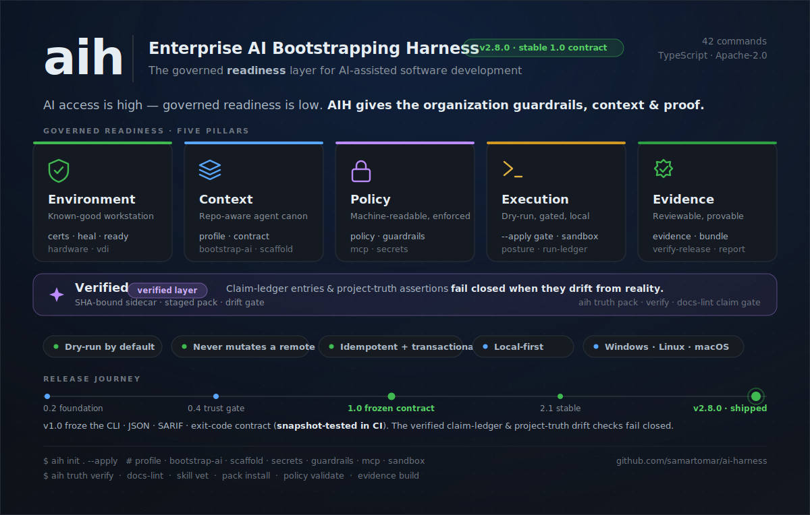
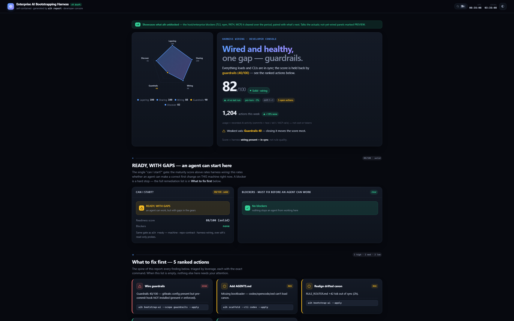

# aih — Enterprise AI Bootstrapping Harness

[](https://github.com/samartomar/ai-harness/actions/workflows/ci.yml)
[](https://github.com/samartomar/ai-harness/actions/workflows/codeql.yml)
[](https://scorecard.dev/viewer/?uri=github.com/samartomar/ai-harness)
[](https://app.codecov.io/gh/samartomar/ai-harness)
[](LICENSE)
[](package.json)

<p align="center">
  
</p>

A cross-platform CLI that helps prepare developer workstations and repositories for
**reviewable, governed AI-assisted coding in enterprise environments** — from
locked-down, TLS-intercepted networks to open ones. It extracts corporate trust,
tunes local inference, adds repo guardrails, wires up MCP / observability /
sandboxing, and lays down a tool-agnostic context architecture — all from one
command surface. On top of that setup it runs a governance loop for external
agent skills — vet → approve → pack → marketplace → evidence — anchored in a
committed approval lock (`aih-skills.lock.json`).

> Implements the architectural blueprint *"Enterprise DevSecOps AI Bootstrapping:
> Cryptographic Trust, Local Performance Optimization, and Unified Observability"*
> as a tested CLI.

> **Provided as open-source software under Apache-2.0 on an "AS IS" basis.** No warranty,
> support obligation, SLA, indemnity, consulting, or professional advice is provided. `aih`
> is dry-run by default — review the plan before running `--apply`. See [DISCLAIMER.md](DISCLAIMER.md).

## Design posture

- **Dry-run by default.** `aih <cmd>` computes and prints a plan; nothing is
  written until you add `--apply`. Add `--verify` to run read-only checks.
- **Gated writes.** `--apply` refuses a dirty git worktree unless you add
  `--force`. Commands resolve a governance posture (`--posture vibe|team|enterprise`,
  default `vibe`): the skill-install gate refuses unapproved skills at
  `team`/`enterprise` and stays advisory at `vibe`; pack installs are fail-closed
  at every posture. Once a repo is initialised, every run is recorded in the
  local [run ledger](#run-ledger).
- **Never mutates a remote system.** Every unit of work is a local `write`, a
  local `exec` (icacls/chmod/junction…), a read-only `probe`, or a `doc` (the
  exact commands for cloud setup — SSO, gateways, Langfuse, MDM — emitted for a
  human, never executed). There is no code path that provisions cloud infra, so
  an automated run cannot "fake" it.
- **Idempotent & non-destructive.** Shell-profile edits live in marked managed
  blocks; JSON configs are deep-merged (your keys survive); every overwrite is
  backed up to `*.aih.bak` and rolls back as a transaction on failure.
- **Cross-platform.** Windows and Linux are verified on real metal (Windows:
  PowerShell/icacls/junctions; Linux: real `/proc`, `/etc/ssl/certs`, `chmod`,
  `ln -sfn`, smoke-tested in a Hyper-V Ubuntu VM). macOS is implemented and
  fixture-tested. All OS calls go through an injectable runner.

## Install

```bash
npm install -g @aihq/harness      # then run: aih --help
```

Verify the install's origin — every release is published with build provenance:

```bash
npm audit signatures
```

<details><summary>From source (contributors)</summary>

```bash
npm install        # deps
npm run build      # → dist/cli.js  (bin: aih)
node dist/cli.js --help
```
</details>

## Quickstart

```bash
aih doctor              # read-only: is the workstation ready for AI coding?
aih init .              # preview the full repo bootstrap (dry-run — nothing is written)
aih init . --apply      # apply it
```

## Command surface

| Command | What it does |
| --- | --- |
| `aih certs` | Extract the corporate root CA from the OS trust store, lock it down, and propagate trust to npm/pip/cargo/conda. |
| `aih heal` | Diagnose **and repair** the broken runtime `certs` assumes works — corporate TLS trust, npm, PATH, and MCP pre-flight — generically for any TLS-intercepting proxy (`--ca-pattern`/`AIH_CA_PATTERN`, never hardcoded). Diagnoses by default (exits non-zero when broken) and repairs under `--apply`; the npm self-heal is emitted as an operator-run script (never executed) and the only mutation is a local Windows registry write to persist the CA for GUI-launched apps (Claude/Kiro), so the harness never contacts a remote. `--scope certs,npm,path,mcp,all`. |
| `aih tools` | Install the agent shell tools the harness leans on — `rg`/`fd`/`jq` plus `ast-grep`/`comby`/`tree`/`gh`/`code-review-graph` — through the platform package manager. Dry-run previews; `--apply` installs. A blocked install on a locked-down box is escalated as an IT ticket rather than failing silently. |
| `aih ready` | Readiness gate — one graded, blocker-aware verdict answering "can a developer start work with an AI agent here, now?", composed from aih's read-only probes (runtime/TLS/PATH/core tools, per-CLI loadability, contract, secret scan). Diagnoses by default (non-zero when blocked); the one auto-fixable blocker (missing `rg`/`fd`/`jq`) installs under confirmation. Surfaces a `sec-ready` panel in `aih report --v9`. |
| `aih hardware` | Profile CPU/RAM/GPU; compute memory/thread/parallel limits + quantization; emit tuned Ollama/llama.cpp settings. |
| `aih vdi` | Detect VDI (Citrix/WorkSpaces/RES/RDP) and redirect caches + SQLite to local scratch (junction on Windows). |
| `aih profile` | Recursively detect the repo's stack and synthesize Cursor stack rules (`.cursor/rules/*.mdc`). Root bootloaders are owned by `bootstrap-ai`. |
| `aih ecc` | Install [affaan-m/ECC](https://github.com/affaan-m/ECC) (skills, instincts, memory, security, research-first) for the selected CLIs, scoped to the detected stack: Claude plugin path, `ecc-install` for codex/cursor/zed/opencode, `consult` advisor otherwise. |
| `aih superpowers` | Install [obra/Superpowers](https://github.com/obra/Superpowers) (brainstorm → plan → TDD → subagent-review skills) for the selected CLIs. |
| `aih scaffold` | Create the canonical context dir (`--context-dir`, default `ai-coding`) — INDEX/SKILL skeleton, an agent **`SETUP-TASKS.md`** playbook (fill context + guardrails from the code), a write-once `project-guardrails.md`, a secret deny-list, and a pre-commit hook. (Bootloaders are `bootstrap-ai`'s job.) |
| `aih guardrails` | Generate `.gitleaks.toml`, `.pre-commit-config.yaml`, and a CI license gate that blocks AGPL/strong-copyleft. |
| `aih secrets` | Scan for plaintext `.env*`/`secrets/` and write agent deny rules + vault-injection guidance. `--verify` is the **secret-scan CI gate** (exit 1 when plaintext secrets exist); `--sarif <file>` emits one error-level result per path for GitHub code-scanning. |
| `aih trust` | Vet, pin, and gate external GitHub repos and skills before an agent acquires them. `scan <target>` grades danger (auto-exec hooks, dependency-confusion, typosquat, incoming-MCP, secrets) and emits SARIF; `allow`/`pin` record reviewed sources + pinned SHAs in org policy; `list`/`verify` audit the committed policy and trust-lock evidence. |
| `aih skill` | The **skill lifecycle** on top of `trust` — a complete governance loop for external agent skills. `vet <src>` runs the read-only gate pipeline (shape, license, trust scan) to a **GREEN/YELLOW/RED/UNKNOWN** verdict + a local evidence artifact (never installs). `card`/`approve --pin --owner` turn that evidence into committed governance: a skill card + a root **`aih-skills.lock.json`** entry, behind a fail-closed chain (pin → evidence → approvable verdict → license → owner; RED blocked, UNKNOWN refused, YELLOW = the manual review). The lockfile has **install-time teeth**: `workspace add` refuses promoting a skill with no committed approval *for that source's pinned commit* at `team`/`enterprise` posture (advisory at `vibe`) — a same-named skill from an unrelated source never inherits an approval, and stale approvals are refused. `inventory` joins on-disk skills against the approvals — approved / unapproved / stale-pin / quarantined, one row per physical install — and feeds a "Skill governance" panel in `report --v9`. `quarantine --name <skill>` **disables reversibly** (dir → `.aih/quarantine/`, approval kept; move it back to restore). `remove --name <skill>` retracts: archives the skill dir reversibly (`--delete` to hard-delete), drops the approval + card; refuses ambiguous duplicates, nested-skill collateral, machine-root installs, and stranding a parked copy's approval; cleans up orphaned approvals. |
| `aih pack` | **Curation manifests** on top of the per-skill lifecycle — a committed root `aih-packs.json` names sets of approved skills so a team installs "the docs-quality pack", not N individual approvals. The `aih-skills.lock.json` stays the **pin authority**: every manifest ref is a fail-closed cross-check against the lock entry (`pack.pin-mismatch` blocks; a disagreeing manifest is never a second pin). `status`/`validate` grade each pack on the two orthogonal axes (approval × install) — `validate` is the **CI gate** (coded findings: `pack.missing-approval`, `pack.pin-mismatch`, `pack.duplicate-name`). `add`/`remove-entry`/`init` author the manifest with refs **derived from the lock** (authoring never invents a pin; `init` seeds a pack from `skill approve --pack` tags; an emptied pack is dropped whole). `plan`/`install` drive the gated two-phase acquisition once per source — **gate ALL sources before promoting ANY**, promote only the pack's refs (subset-exact), route drifted installs back through the gate, resume idempotently — fail-closed at every posture (clean approvals required even at `vibe`; `--acknowledge` refused, acknowledgements stay per-source). `uninstall` retracts every installed member with `skill remove`'s exact per-member semantics — reversible archive (or `--delete`), approval + card dropped, loader-ref advisories, the same refusal guards, and **one blocked member refuses the whole plan**; the manifest curation stays. Installed skills' pack tags roll up in the report's Skill-governance panel. |
| `aih marketplace` | Package the approved skill set into a **reproducible, verifiable distribution artifact** — a directory a team can host anywhere (git repo or static host), never a registry/server. `build` reads `aih-skills.lock.json` (the **approval authority**) and emits the exact vetted skill bytes (trust-lock hash cross-checked), the committed skill cards, the content-addressed vet evidence, a `marketplace.json` manifest, and `SHA256SUMS` — byte-identical across builds from identical inputs (no wall-clock; `--stamp` is operator-supplied), and **fail-closed whole**: an approved skill that is uninstalled, drifted, ambiguous, or missing its card/evidence refuses the entire build. `validate` is the **read-only CI gate** over a built or fetched artifact (coded findings: `marketplace.manifest-parse`, `marketplace.path-traversal`, `marketplace.missing-file`, `marketplace.checksum-mismatch`, `marketplace.sums-coverage`, `marketplace.unapproved-verdict`, `marketplace.signature`), containment-checking every manifest/sums path **before** touching the filesystem with it. `publish` signs the artifact's `SHA256SUMS` (cosign or a GitHub attestation — a publish without a signer is refused; that's just a build); `validate --require-signature` then **fails rather than skips** when that signature can't be verified. Consumers stay on `aih workspace add` — the vet gate still runs at consume time. |
| `aih mcp` | Generate the MCP server config **for the targeted CLIs** (`--cli`/`--all-tools`, default claude): Claude/Cursor/Kiro/Kimi get their correct project file written (`.mcp.json`, `.cursor/mcp.json`, …); Codex (TOML), Copilot, OpenCode, Zed, and global-config tools get exact per-tool guidance instead of a file aih would get wrong. Scopes: local/project/remote. For locked-down orgs, `--mode offline` (vendored local-command servers) or `--mode none` (no MCP + a CLI-tool fallback) plus a `managed-mcp.json` admin template. |
| `aih sandbox` | Generate a devcontainer + managed sandbox settings (egress allowlist, `failIfUnavailable`). |
| `aih telemetry` | Inject OpenTelemetry env, a redacting Bindplane collector, and an analytics fetcher (usage + skills endpoints → `{ usage_report, skills }`). |
| `aih report` | Read-only analytics digest. Local: a dev console — agent **context footprint** (token bloat) plus a **per-turn load-group** panel (the heaviest single tool's always-loaded bootloaders — what one tool actually pays per turn, not the union sum; `--gate --token-budget <n>` exits non-zero in CI when it's exceeded). The footprint is **gitignore-honoring** (counts only tracked/untracked-not-ignored source, never generated per-CLI copies — `--all-files` to override; `--since <ref>` narrows to files changed in a PR), **repo & branch status** (current branch, ahead/behind vs main, dirty; `--team` adds in-progress team branches via a `gh` → `git ls-remote` → last-fetched ladder that degrades gracefully when gh/network is blocked), repo config presence, local AI-CLI tooling saturation, and **trends** (unicode sparklines of commits/LOC/adoption/branches over recorded history — see `aih track`). Org (`--org <export.json>`): top skills, tokens by type, **cache savings** (net-of-write estimate), and accept/reject from a saved Admin-API export. Body prints verbatim; `--json` carries structured data; `--format md\|html` writes a static artifact under `--apply`. **`--v9`** opts into the developer-console HTML dashboard with LIVE / PREVIEW / EMPTY panel honesty, machine-relative ECC inventory, usage-by-CLI, heavy lifters, dormant ECC skills, MCP parity, remediation wins, and no-cost local usage analytics; legacy and `--v4` remain opt-in/unchanged. **`--open`** builds the self-contained HTML dashboard and launches it in your browser (implies html + apply); **`--refresh <sec>`** keeps it live — opens once, then regenerates every `<sec>`s while the page auto-reloads (Ctrl+C to stop). Dark by default with a light toggle; fonts are embedded so it works fully offline. Network-free by default; `--team` is the lone opt-in network call. |
| `aih track` | Record one metrics sample (commits 7d, LOC delta, adoption score, branch count, tracked files) to `.aih/history.jsonl` — the time-series behind `aih report` trends. Read-only git/filesystem; dry-run previews, `--apply` appends (idempotent per commit). Wire into a commit / agent-stop hook so history accumulates — e.g. Kiro's `metrics-on-stop` hook (`aih bootstrap-ai --cli kiro`) runs `aih track --apply` automatically. |
| `aih usage` | Install the **multi-tool usage-capture** layer → `.aih/usage.jsonl` (rendered by `aih report` and `aih report --v9`). The **universal floor** is a git `post-commit` hook that records commit activity for **any** tool (it keys off the commit, not the agent). The per-tool **skill/MCP** layer wires in via each CLI's verified local hook (Claude/Codex/Cursor/Gemini/Kiro/…); skills aggregate by source (ECC/canon/user), and `--rollup <repo,repo>` aggregates local logs across repos on demand. Usage is local activity counts only — **no cost, no prompts, no arguments**, machine-local and gitignored. |
| `aih crispy` | Run the CRISPY context-engineering stage machine (deterministic, gate-ordered). |
| `aih bootstrap` | Orchestrate the workstation 4-phase rollout (certs → hardware/vdi → telemetry). |
| `aih bootstrap-ai` | Emit + verify the repo's Layer-2 `ai-coding/` canon: `RULE_ROUTER.md`, per-CLI adapters, and root bootloaders (tool preamble + a regenerated shared block). `--verify` is the drift gate **and a weak-model-safety lint of the generated canon** — every `#[[file:…]]`/backtick reference must resolve and no leftover `<insert>`/`TODO` scaffolding ships (a dangling reference fails the gate; soft-imperative/taste-word prose is advisory). |
| `aih contract` | Synthesize the machine-readable repo contract (`project.json`) from the detected stack — the structured seam agents and tooling read for build/test/lint commands and conventions, alongside the `ai-coding/` prose canon. Merges over any user-added keys (write-once-safe); dry-run previews, `--apply` writes. |
| `aih prune` | Remove the stale per-CLI artifacts a repo still carries for a CLI it no longer targets (the inverse of `bootstrap-ai`). Dry-run preview by default; `--apply` moves aih-owned files to gitignored `.aih/legacy/` (reversible), subtracts aih's managed block **in place** from co-owned bootloaders (never deletes them), and leaves unmarked MCP/settings as manual advisories. Diffed against **committed intent only** (`.aih-config.json`), so a bare run is safe anywhere; a dirty/untracked target refuses without `--force`. `--delete` hard-deletes to a gitignored `*.aih.bak` sibling (never overwriting a prior backup) instead of archiving; `--unrunnable` also prunes a still-targeted CLI whose binary is absent from `PATH` (loud warning; never the default). |
| `aih init` | Initialize a repo: profile + superpowers + bootstrap-ai + scaffold + secrets + guardrails + mcp + sandbox in one pass (one writer per file). ECC is a separate gated network step — run `aih ecc` when ready (it points at ECC's own installer). |
| `aih adopt` | Converge an **existing** AI canon onto aih's managed model **without overwriting your work** (brownfield migration) — for a repo that already has an `AGENTS.md`/`.cursor`/`ai-*` setup. `--migrate-cli` folds committed CLI-native content into the canon (copy + pointer-convert, content-verified, backed up); `--ack <paths>` marks paths as intentionally tool-native so adopt stops flagging them. |
| `aih workspace` | Scaffold a **multi-repo** workspace (parent-only): cross-repo architecture map (write-once) + per-repo discipline, a VS Code `.code-workspace`, combined graph/filesystem MCP spanning every child repo, and a `.aih-workspace.json` marker. |
| `aih bundle` | Build a deterministic **fleet bundle** — the repo contract, org policy, and managed config packaged with a checksum manifest (and an optional `gh`-attested signature) for distribution to a team or CI. `aih verify-bundle` re-checks a bundle against its checksums + signature. |
| `aih policy` | Schema gates for the org policy. `validate` is the **read-only CI gate** over the committed `aih-org-policy.json` — a missing file is a friendly skip (vibe repos carry no org policy), a parse/schema failure is a coded finding (`org-policy.invalid`) — or, under `--bundle <path>`, over a distributable **policy-bundle envelope** (`org-policy.bundle-invalid`, naming which layer failed: the envelope or the embedded policy). |
| `aih evidence` | Package the **audit trail aih already emits** — approval lock, packs manifest, trust lock, skill cards, vet evidence, run logs, report/SARIF outputs — into one deterministic **evidence bundle** (`build`): the exact fleet-bundle layout (`files/<rel>` copies, `manifest.json`, `SHA256SUMS`, optional best-effort `--sign cosign\|gh`) plus `evidence.json`, a typed kind index. Byte-identical across builds from identical inputs (no wall-clock); absent artifact kinds are skipped silently; re-check any copy with `aih verify-bundle --bundle <out>`. |
| `aih doctor` | Fail-closed verification of the workstation/repo configuration (+ workspace mode: validates each child repo). Includes a **canon markdown lint** (read-only) over the scaffolded `ai-coding/` tree. |
| `aih status` | Read-only inventory of what the harness has configured. |

Shared flags: `--apply`, `--force`, `--verify`, `--json`, `--posture <vibe|team|enterprise>`, `--support-out <dir>`, `--no-log`, `--context-dir <dir>`, `--root <dir>`, `--cli <list>`, `--all-tools`, `--detect`, `--yes` (the read-only `doctor`/`status`/`verify-bundle` take the relevant subset).
Settings also read from `AIH_*` env vars (`AIH_APPLY`, `AIH_CONTEXT_DIR`, `AIH_LOG`, …).

### Plugins

At startup `aih` probes for exactly one optional peer package: **`@aihq/enterprise`** — the literal
name, never env- or config-selectable, so nothing can point the probe at other code. When installed,
its `aihCommands` export (a `CommandSpec[]`) registers as native subcommands through the identical
path as the built-ins: shared flags, posture resolution, the dirty-worktree gate, and the run ledger
all apply unchanged. Not installed → zero output, fully local. `AIH_NO_PLUGINS=1` disables the
probe. A plugin that fails to load, exports the wrong shape, or ships an invalid spec degrades to
local-only with a one-line `aih: plugin:` warning on stderr — and a plugin command can never shadow
a built-in (built-ins always win). Installing the plugin package **is** the trust decision:
importing it runs its code, exactly like any other dependency you install.

The probe is hardened at its seams. The package must resolve from **the install tree `aih` itself
runs from** (the `node_modules` chain above the aih binary), so a global or `npx`-run `aih` pointed
at an untrusted repo never imports a `node_modules/@aihq/enterprise` planted inside that repo.
Honesty note: when aih is installed *inside* the target repo, the repo already controls the binary
itself — the boundary is exactly "the tree aih runs from", nothing stronger. The import also races
a 2-second startup budget (timeout → local-only with a warning), and `aih --version` skips the
probe entirely. Plugin specs cannot claim shared or reserved flags (`--apply`, `--json`, `--help`,
…), cannot take the names `help`/`version`, and any `skipWorktreeGate` field is stripped — the
dirty-worktree preflight always applies to plugin commands.

### Dashboard

`aih report --open` builds a **self-contained, offline** HTML dashboard (dark by default with a
light toggle; fonts embedded) — context footprint + a KPI strip, an adoption ring, output-velocity
and code-quality panels, and trend sparklines from recorded history (`aih track`). Add `--v9` for
the newer developer-console dashboard: every panel is explicitly LIVE, PREVIEW, or EMPTY, so demo
data never reads as real. When the report derives findings (see [Support tickets](#support-tickets)),
a **Suggested actions** section leads with copy-to-clipboard tickets. Add `--demo` for showcase data,
or `--refresh <sec>` to keep it live.



*The `--v9` developer console with `--demo` showcase data: harness-wiring score, ranked
fix actions, and the remediation ledger. `aih report --demo --v9` opens the same dashboard
locally.*

### Targeting CLIs

`aih ecc`, `aih superpowers`, and `aih bootstrap-ai` only touch the agent CLIs you actually use.
Pass `--cli` with a comma-separated list, `--all-tools` for every supported CLI, or `--detect` to
auto-target the CLIs found on this machine; the default is `claude`. Supported:
`claude, codex, cursor, antigravity, gemini, copilot, windsurf, opencode, zed, kimi, kiro`.

```bash
aih bootstrap-ai --cli claude       # writes CLAUDE.md (the default target, auto-loaded)
aih ecc --cli claude,codex          # ECC for Claude (plugin) + Codex (ecc-install)
aih superpowers --cli antigravity   # agy plugin install … (runs under --apply)
aih bootstrap-ai --cli kiro         # Kiro: .kiro/steering/00-canon.md (inclusion: always)
aih bootstrap-ai --detect           # target only the CLIs installed here
aih init . --all-tools              # bootstrap a repo for every CLI at once
```

Each CLI gets its native entry: **Claude → `CLAUDE.md`** (the default target, auto-loaded),
Codex/OpenCode/Zed/Kimi/Antigravity → `AGENTS.md`, Gemini → `GEMINI.md`, Cursor →
`.cursor/rules/*.mdc`, Windsurf → `.windsurfrules`, Copilot → `.github/copilot-instructions.md`,
Kiro → `.kiro/steering/00-canon.md` (`inclusion: always`, with a `#[[file:…/RULE_ROUTER.md]]`
live-reference). For a tool aih doesn't target yet, `<context-dir>/adapters/other-tools.md`
documents how to point it at `RULE_ROUTER.md`.

**Per-tool depth (Kiro example).** Claude reuses your `~/.claude` baseline, so its entry is just
`CLAUDE.md`. Tools that can't read `~/.claude` get fuller native content instead — Kiro is the
deepest case (schemas verified against [Kiro's docs](https://kiro.dev/docs/steering/) and ECC's
real `.kiro/` tree):

- `aih bootstrap-ai --cli kiro` → `.kiro/steering/agent-tools.md` (stack-aware CLI usage) +
  stack-aware `.kiro/hooks/*.kiro.hook` files (`aih-secret-scan-on-create`, `aih-tests-on-edit`,
  `aih-quality-gate` running the repo's real lint/test) in Kiro's real hook schema.
- `aih ecc --cli kiro` → runs ECC's **native** `.kiro/install.sh` (copies ECC's agents/skills/
  steering/hooks into `.kiro/`) when a local ECC checkout is found (`--ecc-path <dir>`, or
  `~/.claude/ecc`, `~/ECC`); otherwise documents the `git clone` + install.
- `aih superpowers --cli kiro` → `.kiro/steering/superpowers-methodology.md` (the
  brainstorm → plan → TDD → review routing, since Kiro can't load `~/.claude/superpowers`).

**Detection** (`--detect`) targets runnable CLI binaries on PATH. Config dirs (`~/.claude`,
`~/.codex`, `~/.gemini`, `~/.cursor`, `~/.kiro`, …) are still reported as config-only traces, but
they are advisory and may be stale; they do not drive setup unless you explicitly type the CLI with
`--cli` or `--all-tools`. Precedence: `--all-tools` > `--cli` > `--detect` > committed marker >
runnable CLIs > default `claude`. When `--detect` finds no runnable CLI it defaults to `claude` and
says so. **In an interactive terminal, `--detect` shows the runnable list and any config-only traces
before asking you to confirm or edit it** (press Enter to accept, or type a comma-separated list to
add/remove tools) before anything installs — pass `--yes` (or run non-interactively / piped /
`--json`) to skip the prompt and use the runnable list as-is. `aih doctor` reports runnable vs
config-only CLIs, and `aih bootstrap-ai --verify` adds a per-CLI **"installed"** confirm step (pass =
runnable binary on PATH, skip = config-only/not here yet, bootloader still written) alongside the
drift gate.

**Canon directory name.** Every generated file and reference adopts `--context-dir <name>` — use any
name you like; the default is the visible `ai-coding/`:

```bash
aih init                          # → ai-coding/   (default, visible)
aih init --context-dir my-canon   # → my-canon/    (any name; everything adapts)
aih init --context-dir .ai-context  # → hidden, the old default
```

Shell-runnable installs (`ecc-install`, `agy`/`copilot plugin install`) execute under `--apply`;
in-tool slash-command installs (Claude/Codex/Kimi plugins) are emitted as exact commands to run
inside the tool. ECC and Superpowers are complementary — ECC supplies stack-aware rules, agents,
and memory; Superpowers supplies the disciplined agent loop that uses them.

### Layered AI canon (`bootstrap-ai`)

The harness models the same two-layer setup used in the reference repos (eicp / ai-os / syntegris):

- **Layer 1 — user baseline:** ECC + Superpowers, installed per CLI by `aih ecc` / `aih superpowers`.
- **Layer 2 — repo canon:** the committed `ai-coding/` (or `--context-dir`) tree — `RULE_ROUTER.md`
  (stack-aware routing entry point), `adapters/<cli>.md` (per-tool wiring notes), `REGENERATION.md`,
  and the root **bootloaders** (`CLAUDE.md`, `AGENTS.md`, `GEMINI.md`, Cursor/Windsurf/Copilot).

`aih bootstrap-ai` generates and verifies Layer 2. Each bootloader is hand-editable tool-specific
content **plus one marker-delimited shared block** that `bootstrap-ai` regenerates idempotently —
your edits outside the markers survive (merged in, with an `.aih.bak` backup). `aih bootstrap-ai --verify`
is the **drift gate**: it fails if the router is missing or a bootloader's block has been hand-edited
away from the canonical source — wire it into CI to keep every tool's entry point in sync.

```bash
aih bootstrap-ai --all-tools --apply   # lay down RULE_ROUTER + adapters + bootloaders for every CLI
aih bootstrap-ai --verify              # CI drift gate (no writes; exit 1 on drift)
```

Precedence: **Layer 2 wins** on conflict — repo canon overrides the generic baseline. Run
`aih scaffold` for the context dir (`INDEX/architecture/conventions`) the router points at.

### Multi-repo workspaces

Most orgs split a product across **separate repos** (a UI repo and a backend repo in one git org). An
agent editing the UI then has no view into the backend — no cross-repo blast radius. `aih workspace`
bridges that gap from the **parent folder** that holds the repos:

```bash
aih workspace ./my-org --apply     # auto-detects child repos (*/.git); or --repos ui,backend
```

It writes, at the parent (it does **not** touch the child repos — run `aih init` in each):

- `<context-dir>/cross-repo-architecture.md` — per-repo responsibilities + a **cross-repo feature map**
  (UI column · backend column · the contract). **Write-once** — aih seeds it from your repo list, then
  you own it; re-running never overwrites it.
- `<context-dir>/repo-discipline.md` — load a repo's own canon before editing it.
- `CLAUDE.md` + `AGENTS.md` — thin workspace bootloaders pointing at the cross-repo canon.
- `<name>.code-workspace` — opens every repo in one VS Code window.
- `.mcp.json` — combined **code-review graph + filesystem MCP** spanning every child repo path, so an
  agent at the workspace root can reason about cross-repo blast radius before editing a child repo.
- `.aih-workspace.json` — marker that puts `aih doctor` into **workspace mode** (validates each child
  repo is scaffolded).

### Support tickets

Any verifying command (`aih doctor`, `aih heal`, `aih bootstrap-ai --verify`, `aih secrets --verify`, …)
turns a failed or skipped check that carries a `Check.code` into a **ticket-ready, tool-neutral support
template** — so a developer blocked by corporate environment config (untrusted CA, broken npm, blocked
registry) can escalate without hand-writing the ask. `aih report` also derives its own **advisory**
findings from the analytics panels (per-turn context **over budget**, incomplete **adoption** in an
initialised repo) as developer self-fix notes — they never fail the run (a bare `aih report` still exits
0; only `--gate` makes the budget a CI gate). Templates render in three registers, keyed off who fixes
the issue:

- **External escalation** — an external-audience check that **failed**; the fix is a system change owned
  by IT, security, or the dev-platform team (untrusted corporate CA, broken package manager, unreachable
  registry). Blocking failures lead with `[<project>] Blocking setup issue — …`.
- **External improvement request** — an external-audience check that **skipped**: a non-blocking
  configuration gap that degrades the setup without blocking it.
- **Developer self-fix note** — a developer-audience finding the developer resolves directly (install
  git, `aih mcp --apply`); terse, runnable, and the only register that may name `aih`.

By default the terminal prints one `[copy] …` label per template under a **Support templates:** heading.
Add **`--support-out <dir>`** to write each full ticket to a repo-contained `<dir>/<code>.md` file (you
named the path — that's the consent, same as `--sarif <file>`). **`--json`** carries the data under a
top-level `support: { findings, templates }` key. Support output is **suppressed when streaming SARIF**
(`--sarif -`) so stdout stays a clean code-scanning artifact.

**External tickets are tool-neutral by contract** — they never name aih or its commands; they describe
the failed *internal configuration* the recipient must fix at the system level. Each follows the
structure **Summary → Impact → Issue → Observed evidence → Environment → Requested fix → Acceptance
criteria**, and every escalation ends with a security work-around guard (keep TLS verification and secret
controls enabled; don't change project code). Evidence, affected area, and acceptance criteria are canned
per code — never guessed — with the live check detail riding along as evidence (redacted: home-dir
scrubbed, secret-aware argv masking).

**Project context (`SETUP.md`).** A project can shape the tickets with opt-in HTML-comment markers in
`SETUP.md`, `docs/SETUP.md`, or `.aih/SETUP.md` (first found wins):

- `<!-- support:why -->…<!-- /support:why -->` — *why a correct environment matters for this project*,
  woven into the ticket's Impact / "Why this helps" section. Falls back to the first paragraph under a
  `## Why` / `## Overview` / `## Purpose` / `## Background` / `## About` heading, so existing setup files
  contribute without edits.
- `<!-- support:routing -->…<!-- /support:routing -->` — real routing metadata (assignment group, ticket
  prefix) rendered verbatim in the Environment block. **Never invented** — shown only when you provide it.
- `<!-- support:language -->…<!-- /support:language -->` — an instruction to adapt the message to the
  org's corporate language, surfaced as a **terminal note** to the author, never embedded in the ticket
  body (which stays clean to paste).

### Run ledger

Every `aih` invocation appends one structured row to **`.aih/runs/YYYY-MM.jsonl`** (UTC, month-sharded,
append-only) — a "what happened" diagnostics trail: run id, capability, redacted argv, status (`success` /
`failed` / `partial` / `error`), exit code, mode (apply/verify/json/sarif), platform, write tally, and
verification + support counts. It's distinct from `.aih/history.jsonl` (the per-commit metrics behind
`aih report` trends). Logging is **on only after the repo is initialised** (a committed `.aih-config.json`
marker exists) and never fails a command; opt out with **`--no-log`** or **`AIH_LOG=0`**. Like all of
`.aih/`, the ledger is gitignored local diagnostics — never committed.

### Examples

```bash
aih doctor --json                 # what's configured? (read-only)
aih init . --apply                # bootstrap the current repo
aih certs --ca-pattern Zscaler --apply --verify
aih hardware                      # preview the tuned inference env block
AIH_CONTEXT_DIR=ai-coding aih scaffold --apply
aih doctor --support-out .aih/tickets   # write IT/support tickets for failing checks (kept local)
aih report --v9 --apply --out .aih/reports/local-v9.html
aih usage --apply --cli claude,codex,gemini
aih usage --rollup ../repo-a,../repo-b
```

## Releases & roadmap

- **Roadmap** — [ROADMAP.md](ROADMAP.md), tracked as
  [GitHub Milestones](https://github.com/samartomar/ai-harness/milestones).
- **Changelog** — [CHANGELOG.md](CHANGELOG.md); tagged builds on
  [Releases](https://github.com/samartomar/ai-harness/releases).
- **Versioning & support** — [VERSIONING.md](VERSIONING.md). SemVer; from 1.0, security
  fixes land on the latest **and the previous minor** (N-1) of the current major.
- **Supply chain** — every release publishes via npm **Trusted Publishing** with build
  **provenance** and ships an **SPDX SBOM**, a **SHA256 checksum**, its keyless **cosign
  signature bundle** (`SHA256SUMS.txt.sigstore.json`), and the Sigstore **build-provenance
  bundle** on the GitHub Release. Verify an install with `npm audit signatures`.
- **Support** — [SUPPORT.md](SUPPORT.md) · **Security** — [SECURITY.md](SECURITY.md)
  (private reporting) · **Contributing** — [CONTRIBUTING.md](CONTRIBUTING.md).

## Development

```bash
npm test          # vitest
npm run typecheck # tsc --noEmit
npm run lint      # biome
npm run build     # tsup → dist/
```

Stack: TypeScript (ESM) · commander · zod · vitest · biome · tsup. Coverage floors
are enforced in [vitest.config.ts](vitest.config.ts) — set just below the achieved
levels so coverage only ratchets up; CI and releases fail on regression. See
[CONTRIBUTING.md](CONTRIBUTING.md) for the contributor workflow.

### Stability

The CLI surface and machine-readable outputs are contract-tested in
[tests/contract/](tests/contract/): every command and option is snapshotted against a
committed fixture ([command-surface.json](tests/contract/command-surface.json)), the
`--json` envelope is schema-pinned, and exit-code semantics are pinned. Any drift fails
CI and forces a reviewed decision — additive changes regenerate the fixture in the same
PR (label it `contract:additive`); removals or renames of anything pinned are breaking
and ship in majors only, per the stability policy in [STABILITY.md](STABILITY.md) —
renames ship with a deprecated alias of the old name until the removing major.

## License

[Apache-2.0](LICENSE).
