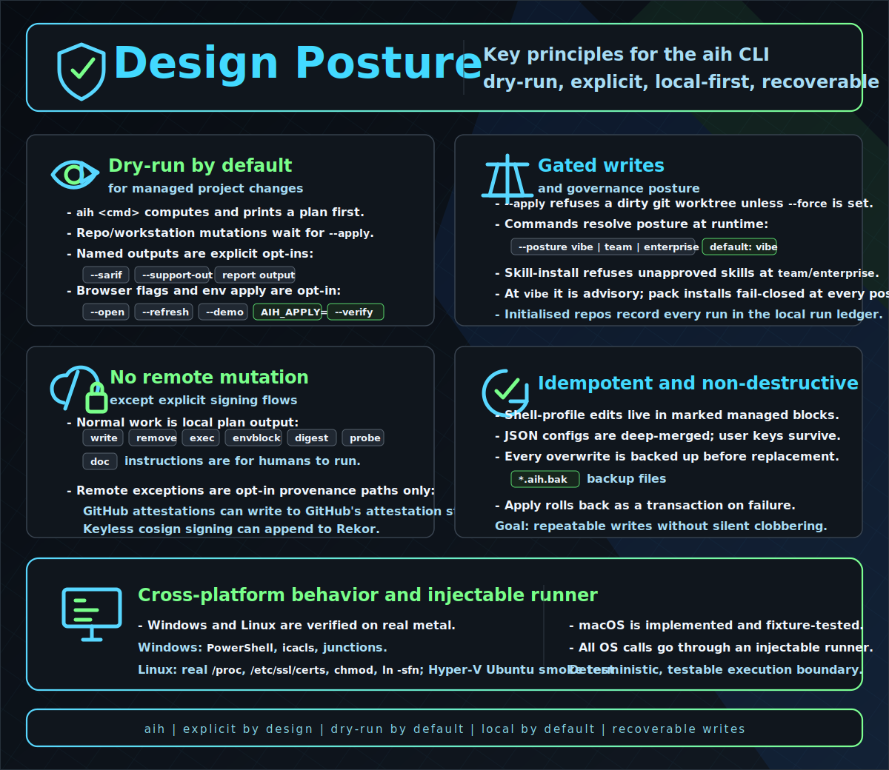
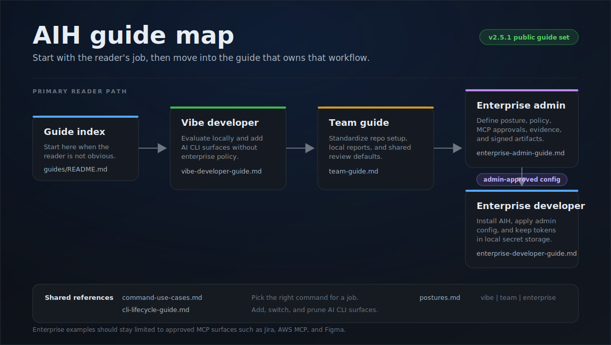
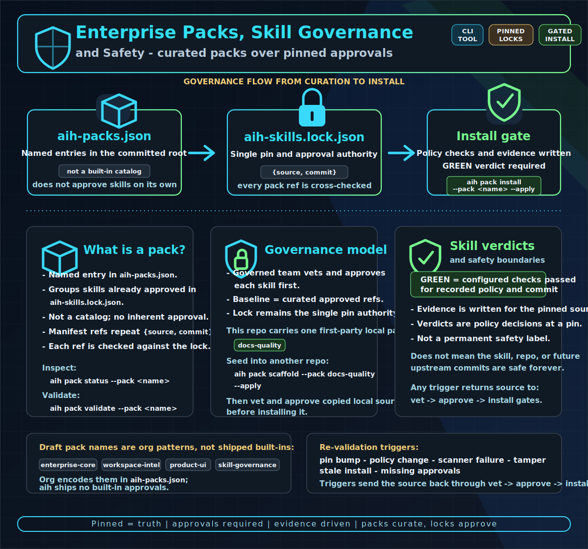

# aih — Enterprise AI Bootstrapping Harness

[](https://github.com/samartomar/ai-harness/actions/workflows/ci.yml)
[](https://github.com/samartomar/ai-harness/actions/workflows/codeql.yml)
[](https://scorecard.dev/viewer/?uri=github.com/samartomar/ai-harness)
[](https://app.codecov.io/gh/samartomar/ai-harness)
[](LICENSE)
[](package.json)

<p align="center">
  
</p>

A cross-platform CLI that helps prepare developer workstations and repositories for
**reviewable, governed AI-assisted coding in enterprise environments** — from
locked-down, TLS-intercepted networks to open ones. It extracts corporate trust,
tunes local inference, adds repo guardrails, wires up MCP / observability /
sandboxing, and lays down a tool-agnostic context architecture — all from one
command surface. On top of that setup it runs a governance loop for external
agent skills — vet → approve → pack → marketplace → evidence — anchored in a
committed approval lock (`aih-skills.lock.json`).

See [docs/ARCHITECTURE.md](docs/ARCHITECTURE.md) for the shipped architecture and
current trust boundaries, and [docs/CONTROL_MATRIX.md](docs/CONTROL_MATRIX.md) for
the claim -> implementation -> test proof map.

> **Provided as open-source software under Apache-2.0 on an "AS IS" basis.** No warranty,
> support obligation, SLA, indemnity, consulting, or professional advice is provided. `aih`
> is dry-run by default — review the plan before running `--apply`. See [DISCLAIMER.md](DISCLAIMER.md).

## The stable command contract

For the current v2 line, pin `@aihq/harness@^2` unless your organization pins an
exact release for reproducible rollout. Every command, flag, and deprecated alias is
snapshot-tested in CI against a committed fixture, the `--json` envelope is
schema-pinned, and exit-code semantics are pinned — a surface change fails the build
until it ships as a reviewed contract decision. Renames ship as deprecated aliases
(the old name keeps working, with a one-line warning) before a major removes them,
and security fixes land on the latest minor — upgrading is the fix path. The full
policy: [STABILITY.md](STABILITY.md).

## Design posture

<p align="center">
  
</p>

## Install

Install and verify a published release. Current releases publish npm provenance plus GitHub release
checksums and a keyless cosign bundle:

```bash
npm install -g @aihq/harness@2.11.0      # then run: aih --help
aih verify-release 2.11.0   # checks npm signatures, GitHub release sums, and cosign evidence for 2.11.0
```

Full release verification requires local `npm`, `gh`, and `cosign`; proceed only when all three legs
pass. A skipped leg is incomplete evidence, not a successful rollout gate.

<details><summary>From source (contributors)</summary>

```bash
npm install        # deps
npm run build      # → dist/cli.js  (bin: aih)
node dist/cli.js --help
```
</details>

## Quickstart

```bash
aih doctor              # read-only: is the workstation ready for AI coding?
aih init .              # preview the full repo bootstrap (dry-run — nothing is written)
aih init . --apply      # apply it
```

## Guides by workflow

Use the command reference for exact CLI behavior; use the guides when you need the
right workflow for a reader or rollout stage.



| Reader need | Start here |
| --- | --- |
| Pick the right command for a task | [Command Use Cases](guides/command-use-cases.md) |
| Add, switch, or prune AI CLI surfaces | [CLI Lifecycle](guides/cli-lifecycle-guide.md) |
| Understand posture behavior and boundaries | [Postures](guides/postures.md) |
| Individual developer or evaluator | [Vibe Developer](guides/vibe-developer-guide.md) |
| Shared repository or platform team | [Team Guide](guides/team-guide.md) |
| Governed organization or enterprise rollout | [Enterprise Admin](guides/enterprise-admin-guide.md) |
| Developer consuming an admin-approved config | [Enterprise Developer](guides/enterprise-developer-guide.md) |

## Command surface

One honest line per command — the long-form behavior detail for every command lives in
[docs/commands.md](docs/commands.md), and `aih <command> --help` is authoritative for flags.
Keep this table as a navigation index: do not add flag-level behavior or workflow recipes here.

### Workstation & runtime

| Command | What it does |
| --- | --- |
| [`aih certs`](docs/commands.md#aih-certs) | Extract the corporate root CA from the OS trust store and propagate trust to npm/pip/cargo/conda. |
| [`aih heal`](docs/commands.md#aih-heal) | Diagnose and repair the broken runtime behind any TLS-intercepting proxy — corporate trust, npm, PATH, MCP pre-flight. |
| [`aih tools`](docs/commands.md#aih-tools) | Install the agent shell tools the harness leans on (`rg`/`fd`/`jq`, `ast-grep`, `gh`, …) through the platform package manager. |
| [`aih ready`](docs/commands.md#aih-ready) | Grade a blocker-aware readiness verdict: can a developer start work with an AI agent here, now? |
| [`aih session-guard`](docs/commands.md#aih-session-guard) | Inspect session/action text offline for secret-like values and dangerous local actions. |
| [`aih hardware`](docs/commands.md#aih-hardware) | Profile CPU/RAM/GPU and emit tuned Ollama/llama.cpp settings. |
| [`aih vdi`](docs/commands.md#aih-vdi) | Detect VDI (Citrix/WorkSpaces/RES/RDP) and redirect caches + SQLite to local scratch. |
| [`aih bootstrap`](docs/commands.md#aih-bootstrap) | Orchestrate the workstation 4-phase rollout (certs → hardware/vdi → telemetry). |

### Repo canon & bootstrap

| Command | What it does |
| --- | --- |
| [`aih init`](docs/commands.md#aih-init) | Initialize a repo in one pass: profile + superpowers + bootstrap-ai + scaffold + contract + secrets + guardrails + mcp + sandbox + usage. |
| [`aih profile`](docs/commands.md#aih-profile) | Detect the repo's stack recursively and synthesize Cursor stack rules (`.cursor/rules/*.mdc`). |
| [`aih scaffold`](docs/commands.md#aih-scaffold) | Scaffold repo hygiene — secret deny-list, pre-commit hook, `.gitignore` entries; `--canon legacy` adds the full context-doc family. |
| [`aih bootstrap-ai`](docs/commands.md#aih-bootstrap-ai) | Emit and verify the repo's Layer-2 canon — `RULE_ROUTER.md`, per-CLI adapters, root bootloaders; `--verify` is the drift gate. |
| [`aih contract`](docs/commands.md#aih-contract) | Synthesize the machine-readable repo contract (`project.json`) from the detected stack. |
| [`aih capability`](docs/commands.md#aih-capability) | Resolve repo agent-capability needs into committed intent and a rebuildable machine cache. |
| [`aih adopt`](docs/commands.md#aih-adopt) | Converge an existing AI canon onto aih's managed model without overwriting your work (brownfield migration). |
| [`aih prune`](docs/commands.md#aih-prune) | Remove stale per-CLI artifacts and reconcile orphaned aih-managed ECC components from the machine registration ledger. <!-- aih:claim CM-22 --> |
| [`aih uninstall`](docs/commands.md#aih-uninstall) | Remove the marker-backed core aih install footprint from a repo; `aih clean` is an alias. |
| [`aih ecc`](docs/commands.md#aih-ecc) | Register the additive common + project-scoped ECC/MCP union from an evidence-verified exact pin. <!-- aih:claim CM-21 --> |
| [`aih superpowers`](docs/commands.md#aih-superpowers) | Verify exact-pinned Superpowers components and emit evidence-bound target guidance. |
| [`aih crispy`](docs/commands.md#aih-crispy) | Run the CRISPY context-engineering stage machine (deterministic, gate-ordered). |
| [`aih workspace`](docs/commands.md#aih-workspace) | Scaffold and restore a multi-repo workspace at the parent folder: cross-repo map, declared-repo graph MCP, snapshots, hydrate. |

### Skill governance & supply chain

| Command | What it does |
| --- | --- |
| [`aih trust`](docs/commands.md#aih-trust) | Vet, pin, and gate external GitHub repos and skills before an agent acquires them. |
| [`aih skill`](docs/commands.md#aih-skill) | Govern the skill lifecycle — vet → approve → inventory → quarantine → remove — anchored in `aih-skills.lock.json`. |
| [`aih pack`](docs/commands.md#aih-pack) | Curate committed sets of approved skills (`aih-packs.json`); every ref is cross-checked against the lock, fail-closed. |
| [`aih marketplace`](docs/commands.md#aih-marketplace) | Build, validate, and publish a reproducible, verifiable distribution artifact for hostable approved skills — never a registry. |
| [`aih policy`](docs/commands.md#aih-policy) | Project the committed org policy into generated settings, validate it, or verify it against a pinned hash/bundle. |
| [`aih evidence`](docs/commands.md#aih-evidence) | Vet exact-pinned baseline components and package local audit artifacts into deterministic signed evidence bundles. |
| [`aih truth`](docs/commands.md#aih-truth) | Create and verify an external project-truth sidecar; commit, version, claim, decision, acceptance-preflight, and agent-evidence assertions fail closed before a pack helps govern evidence. <!-- aih:claim CM-13 --> |
| [`aih bundle`](docs/commands.md#aih-bundle) | Build a deterministic fleet bundle with checksums; `aih verify-bundle --require-signature` turns missing/unverifiable signatures into failures. |
| [`aih verify-bundle`](docs/commands.md#aih-verify-bundle) | Re-check a fleet or evidence bundle's checksums and signature/provenance evidence. |
| [`aih verify-release`](docs/commands.md#aih-verify-release) | Verify a published aih release: npm signatures, GitHub release cosign bundle, and tarball hash. |
| [`aih secrets`](docs/commands.md#aih-secrets) | Scan for plaintext secret paths and hardcoded MCP config credentials without emitting values; `--verify` is warning-only at `vibe` and non-zero at `team`/`enterprise`. <!-- aih:claim CM-16 --> |
| [`aih guardrails`](docs/commands.md#aih-guardrails) | Generate local gitleaks/pre-commit policy files and a CI license/secret workflow; enforcement requires installing tools and wiring Git hooks or required CI checks. <!-- aih:claim CM-17 --> |

### Enterprise packs, skill governance, and safety

<p align="center">
  
</p>

### Trust configuration notes

`trust.internalScopes` is intentionally inert until an org configures internal package scopes in
policy. Without that scope list, dependency-confusion checks still report general package risk but do
not guess which names are private to your organization.

### Baseline component evidence

`aih ecc` and `aih superpowers` acquire only exact Git commits into quarantine. Selected component
paths must match the vendor lock shipped in the npm release or an attributable GitHub-attested org
bundle. Covered user seats verify hashes and signatures; they do not rerun the release analyzers.
Missing/mismatched coverage warns without an authorization receipt at `vibe` and denies at
`team`/`enterprise`. A signed `blocked` verdict denies at every posture and cannot be waived by org
evidence for the same bytes. See [Baseline Component Evidence](docs/security/baseline-evidence.md)
for the vet/sign/policy flow. <!-- aih:claim CM-20 -->

### Analytics & operations

| Command | What it does |
| --- | --- |
| [`aih report`](docs/commands.md#aih-report) | Render the read-only analytics digest — context footprint, adoption, trends; `--v9`/`--open` build the offline HTML dashboard. |
| [`aih track`](docs/commands.md#aih-track) | Record one metrics sample (commits, LOC delta, adoption) to `.aih/history.jsonl` — the time-series behind `aih report` trends. |
| [`aih usage`](docs/commands.md#aih-usage) | Install the multi-tool usage-capture layer → `.aih/usage.jsonl` — local activity counts only, no cost, no prompts. |
| [`aih telemetry`](docs/commands.md#aih-telemetry) | Inject OpenTelemetry env, a redacting Bindplane collector, and an analytics fetcher. |
| [`aih mcp`](docs/commands.md#aih-mcp) | Generate MCP config for targeted CLIs, warn when first-run detection selects global config targets, and use `--mcp-compliant` to omit denied generated servers from targeted configs. <!-- aih:claim CM-18 --> |
| [`aih sandbox`](docs/commands.md#aih-sandbox) | Generate a devcontainer + managed sandbox settings (egress allowlist, `failIfUnavailable`). |

### Verification

| Command | What it does |
| --- | --- |
| [`aih docs-lint`](docs/commands.md#aih-docs-lint) | Run the read-only BetterDoc prose check and claim-ledger gate over public Markdown; hard claim orphans fail closed, while prose guidance is advisory. <!-- aih:claim CM-12 --> |
| [`aih doctor`](docs/commands.md#aih-doctor) | Verify the workstation/repo configuration fail-closed; workspace mode validates each child repo, and Enterprise posture attests declared capability surfaces. |
| [`aih status`](docs/commands.md#aih-status) | Show a read-only inventory of what the harness has configured. |

Shared flags: `--apply`, `--force`, `--verify`, `--json`, `--posture <vibe|team|enterprise>`, `--support-out <dir>`, `--no-log`, `--context-dir <dir>`, `--root <dir>`, `--cli <list>`, `--all-tools`, `--detect`, `--yes` (read-only commands take the relevant subset).
Settings also read from `AIH_*` env vars (`AIH_APPLY`, `AIH_CONTEXT_DIR`, `AIH_LOG`, …).

### Plugins

At startup `aih` probes for exactly one optional peer package: **`@aihq/enterprise`** — the literal
name, never env- or config-selectable, so nothing can point the probe at other code. The package name
is a reserved extension point; the open-source harness does not require it to be published. When installed,
it contributes additive enterprise command capabilities through its `aihCommands` export
(`CommandSpec[]`) as defined in the
[enterprise extension point spec](docs/product/enterprise-extension-point.md). Those commands register
as native subcommands through the identical path as the built-ins: shared flags, posture resolution,
the dirty-worktree gate, and the run ledger all apply unchanged. Not installed → zero output, fully
local. `AIH_NO_PLUGINS=1` disables the
probe. A plugin that fails to load, exports the wrong shape, or ships an invalid spec degrades to
local-only with a one-line `aih: plugin:` warning on stderr — and a plugin command can never shadow
a built-in (built-ins always win). Installing the plugin package **is** the trust decision:
importing it runs its code, exactly like any other dependency you install.

The probe is hardened at its seams. The package must resolve from **the install tree `aih` itself
runs from** (the `node_modules` chain above the aih binary), so a global or `npx`-run `aih` pointed
at an untrusted repo never imports a `node_modules/@aihq/enterprise` planted inside that repo.
Honesty note: when aih is installed *inside* the target repo, the repo already controls the binary
itself — the boundary is exactly "the tree aih runs from", nothing stronger. The import also races
a 2-second startup budget (timeout → local-only with a warning), and `aih --version` skips the
probe entirely. Plugin specs cannot claim shared or reserved flags (`--apply`, `--json`, `--help`,
…), cannot take the names `help`/`version`, and alias fields plus any `skipWorktreeGate` field are
stripped — aliases are core-owned and the dirty-worktree preflight always applies to plugin commands.

### Dashboard

`aih report --open` builds a **self-contained, offline** HTML dashboard (dark by default with a
light toggle; fonts embedded) — context footprint + a KPI strip, an adoption ring, output-velocity
and code-quality panels, and trend sparklines from recorded history (`aih track`). Add `--v9` for
the newer developer-console dashboard: every panel is explicitly LIVE, PREVIEW, or EMPTY, so demo
data never reads as real. When the report derives findings (see [Support tickets](#support-tickets)),
a **Suggested actions** section leads with copy-to-clipboard tickets. Add `--demo` for showcase data,
or `--refresh <sec>` to keep it live.


*The `--v9` developer console with `--demo` showcase data: harness-wiring score, ranked
fix actions, and the remediation ledger. This image uses demo/local data, not customer
telemetry. `aih report --demo --v9` opens the same dashboard locally.*

### Targeting CLIs

`aih ecc`, `aih superpowers`, and `aih bootstrap-ai` only touch the agent CLIs you actually use.
Pass `--cli` with a comma-separated list, `--all-tools` for every supported CLI, or `--detect` to
auto-target the CLIs found on this machine; the default is `claude`. Supported:
`claude, codex, cursor, antigravity, gemini, copilot, windsurf, opencode, zed, kimi, kiro`.

```bash
aih bootstrap-ai --cli claude       # writes CLAUDE.md (the default target, auto-loaded)
# repeatable declarations add to detection and the prior machine union
aih ecc --cli claude,codex --with framework:react --with lang:typescript
aih superpowers --cli antigravity   # verify exact pin; guidance only (no mutable plugin exec)
aih bootstrap-ai --cli kiro         # Kiro: .kiro/steering/00-canon.md (inclusion: always)
aih bootstrap-ai --detect           # target only the CLIs installed here
aih init . --all-tools              # bootstrap a repo for every CLI at once
```

Each CLI gets its native entry: **Claude → `CLAUDE.md`** (the default target, auto-loaded),
Codex/OpenCode/Zed/Kimi/Antigravity → `AGENTS.md`, Gemini → `GEMINI.md`, Cursor →
`.cursor/rules/*.mdc`, Windsurf → `.windsurfrules`, Copilot → `.github/copilot-instructions.md`,
Kiro → `.kiro/steering/00-canon.md` (`inclusion: always`, with a `#[[file:…/RULE_ROUTER.md]]`
live-reference). For a tool aih doesn't target yet, `<context-dir>/adapters/other-tools.md`
documents how to point it at `RULE_ROUTER.md`.

**Per-tool depth (Kiro example).** Claude reuses your `~/.claude` baseline, so its entry is just
`CLAUDE.md`. Tools that can't read `~/.claude` get fuller native content instead — Kiro is the
deepest case (schemas verified against [Kiro's docs](https://kiro.dev/docs/steering/) and ECC's
real `.kiro/` tree):

- `aih bootstrap-ai --cli kiro` → `.kiro/steering/agent-tools.md` (stack-aware CLI usage) +
  stack-aware `.kiro/hooks/*.kiro.hook` files (`aih-secret-scan-on-create`, `aih-tests-on-edit`,
  `aih-quality-gate` running the repo's real lint/test) in Kiro's real hook schema.
- `aih ecc --cli kiro` → emits scoped consult guidance; Kiro's native installer cannot yet
  materialize the component union safely, so aih does not run it.
- `aih superpowers --cli kiro` → `.kiro/steering/superpowers-methodology.md` (the
  brainstorm → plan → TDD → review routing, since Kiro can't load `~/.claude/superpowers`).

**Detection** (`--detect`) targets runnable CLI binaries on PATH. Config dirs (`~/.claude`,
`~/.codex`, `~/.gemini`, `~/.cursor`, `~/.kiro`, …) are still reported as config-only traces, but
they are advisory and may be stale; they do not drive setup unless you explicitly type the CLI with
`--cli` or `--all-tools`. Precedence: `--all-tools` > `--cli` > `--detect` > committed marker >
runnable CLIs > default `claude`. When `--detect` finds no runnable CLI it defaults to `claude` and
says so. **In an interactive terminal, `--detect` shows the runnable list and any config-only traces
before asking you to confirm or edit it** (press Enter to accept, or type a comma-separated list to
add/remove tools) before anything installs — pass `--yes` (or run non-interactively / piped /
`--json`) to skip the prompt and use the runnable list as-is. `aih doctor` reports runnable vs
config-only CLIs, and `aih bootstrap-ai --verify` adds a per-CLI **"installed"** confirm step (pass =
runnable binary on PATH, skip = config-only/not here yet, bootloader still written) alongside the
drift gate.

**Canon directory name.** Every generated file and reference adopts `--context-dir <name>` — use any
name you like; the default is the visible `ai-coding/`:

```bash
aih init                          # → ai-coding/   (default, visible)
aih init --context-dir my-canon   # → my-canon/    (any name; everything adapts)
aih init --context-dir .ai-context  # → hidden, the old default
```

ECC install actions execute under `--apply` only after exact component evidence clears and the same
quarantined tree re-hashes. By default, `aih ecc` materializes the additive union of its common
baseline, detected or repeatably declared project riders, posture-selected security, and validated
MCPs; `--profile full` is the explicit full-surface opt-in. Evidence verdicts apply per component:
authorized components install, while held components are quarantined and reported with their exact
codes and reasons. No install process starts unless ECC's installer runtime is also authorized.
The project contribution keeps the requested intent, while each target record contains only the
surface actually installed. The primary project/target contribution ledger lives at
`~/.aih/ecc/registration-ledger.json` and commits only after every install step succeeds. A bare
`aih prune` also checks that ledger: missing project roots are retired, the live
component/MCP union is recomputed, and only state-recorded aih-managed operations no longer shared
by a live project are removed. Dry-run reports the diff without mutation; `--apply` hash-binds all
inputs, rolls back partial failure, and replaces target state before committing the ledger last.
Superpowers marketplace/TUI paths cannot bind installed bytes to that
tree, so aih executes none of them; it emits pin-aware guidance and says those marketplace selections
are not evidence-covered. ECC and Superpowers are complementary — ECC supplies stack-aware rules,
agents, and memory; Superpowers supplies the disciplined agent loop that uses them.
For Codex, installed ECC skills are consumed on demand by name, such as `$configure-ecc`, from the
literal Codex skills path (`~/.codex/skills/<name>/SKILL.md`); they are not an ambient auto-loaded
`.agents/skills/` surface. `aih ecc --cli codex` still installs the selected ECC Codex
skills/agents from ECC's manifest, but uses add-only Codex TOML merge helpers and a fenced AGENTS
merge rather than the upstream `ecc-install --target codex` copy mode for shared `~/.codex` files.
Its scoped MCP block contains pinned `sequential-thinking` plus GitHub at team/enterprise (and
repo-declared local graph/memory servers); Context7 and Exa are never defaults.

### Layered AI canon (`bootstrap-ai`)

The harness models the same two-layer setup used in the reference repos (eicp / ai-os / syntegris):

- **Layer 1 — user baseline:** selectable with `--baseline ecc|gstack|gsd` (default `ecc`,
  ECC + Superpowers installed per CLI by `aih ecc` / `aih superpowers`).
- **Layer 2 — repo canon:** the committed `ai-coding/` (or `--context-dir`) tree — `RULE_ROUTER.md`
  (stack-aware routing entry point), the contract files `project.json`, `project.md`, and `setup.md`,
  `adapters/<cli>.md` (per-tool wiring notes), and the root **bootloaders** (`CLAUDE.md`, `AGENTS.md`,
  `GEMINI.md`, Cursor/Windsurf/Copilot). `REGENERATION.md` is emitted only for `--canon legacy`.

`aih bootstrap-ai` generates and verifies Layer 2. Each bootloader is hand-editable tool-specific
content **plus one marker-delimited shared block** that `bootstrap-ai` regenerates idempotently —
your edits outside the markers survive (merged in, with an `.aih.bak` backup). `aih bootstrap-ai --verify`
is the **drift gate**: it fails if the router is missing or a bootloader's block has been hand-edited
away from the canonical source — wire it into CI to keep every tool's entry point in sync.

```bash
aih bootstrap-ai --all-tools --apply   # lay down RULE_ROUTER + adapters + bootloaders for every CLI
aih bootstrap-ai --baseline gstack     # use garrytan/gstack as the Layer-1 baseline
aih bootstrap-ai --verify              # CI drift gate (no writes; exit 1 on drift)
```

Precedence: **Layer 2 wins** on conflict — repo canon overrides the generic baseline. Run
`aih contract` to refresh the contract files the compact router points at.

### Multi-repo workspaces

Most orgs split a product across **separate repos** (a UI repo and a backend repo in one git org). An
agent editing the UI then has no view into the backend — no cross-repo blast radius. `aih workspace`
is a federated bridge, not a monorepo replacement: the child repo owns truth, and the parent workspace
owns routing, contract edges, snapshots, MCP wiring, and report rollups. It bridges that gap from the
**parent folder** that holds the repos:

```bash
aih workspace ./my-org --repos ui,backend --apply
```

It writes, at the parent (it does **not** touch the child repos — run `aih init` in each):

- `<context-dir>/cross-repo-architecture.md` — per-repo responsibilities + a **cross-repo feature map**
  (UI column · backend column · the contract). **Write-once** — aih seeds it from your repo list, then
  you own it; re-running never overwrites it.
- `<context-dir>/repo-discipline.md` — load a repo's own canon before editing it.
- Targeted CLI bootloaders — `CLAUDE.md` by default; `--cli`/`--all-tools` can add
  `AGENTS.md`, `GEMINI.md`, `.kiro/steering/00-canon.md`, and other tool-native entries.
- `<name>.code-workspace` — opens every repo in one VS Code window.
- `.mcp.json` — one **code-review graph MCP** per present declared child repo, using absolute
  root-anchored child paths so MCP clients work from any launch directory.
- `.aih-workspace.json` — marker that puts `aih doctor` into **workspace mode** (validates each child
  repo is scaffolded); object-form repos can retain optional `remote`/`ref` source metadata.
- Child repos are an explicit allowlist: use `--repos` or an existing `.aih-workspace.json`. If child
  Git repos are present without an allowlist, `aih workspace` reports candidates but does not add them
  to `.aih-workspace.json` or workspace MCP scope.
- `aih workspace snapshot --lock --apply` writes the recorded child remote into
  `<context-dir>/workspace-lock.json` when present, so a lock captures both the commit and fetch
  location. A manifest-declared `remote` takes precedence; otherwise snapshot collection reads only
  child-local `origin` config and never fetches.
- `aih workspace hydrate --apply` restores a declared workspace from `.aih-workspace.json` plus the
  committed workspace lock: missing children are cloned from recorded remotes, present clean children
  are checked out to the recorded ref, and children with no recorded remote are skipped with a note.
  Until a declared child exists, `aih workspace --apply` skips that child's graph MCP scope and emits
  a hydrate note instead of wiring an empty path.

### Support tickets

Any verifying command (`aih doctor`, `aih heal`, `aih secrets --verify`, …) turns a failed or skipped
check that carries a `Check.code` into a ticket-ready support template — three registers keyed off who
fixes the issue, and external tickets are tool-neutral by contract (they never name aih). Labels print
by default; `--support-out <dir>` writes full tickets, `--json` carries them. Registers, redaction, and
the `SETUP.md` context markers: [docs/commands.md](docs/commands.md#support-tickets).

### Run ledger

Every `aih` invocation appends one structured row to **`.aih/runs/YYYY-MM.jsonl`** (UTC, month-sharded,
append-only) — a "what happened" diagnostics trail: schema version, run id, capability, redacted argv,
status (`success` / `failed` / `partial` / `error`), exit code, mode (apply/verify/json/sarif), platform,
host hash, repo remote hash, write tally, and verification + support counts. It's distinct from
`.aih/history.jsonl` (the per-commit metrics behind `aih report` trends). Logging is **on only after the
repo is initialised** (a committed `.aih-config.json` marker exists) and never fails a command; opt out
with **`--no-log`** or **`AIH_LOG=0`**. Like all of `.aih/`, the ledger is gitignored local diagnostics
— never committed. `aih evidence build` packages it into a checksummed bundle; use
`aih evidence build --sign <signer> --require-signature` when the bundle crosses a
sharing boundary that requires tamper evidence.

### Examples

```bash
aih doctor --json                 # what's configured? (read-only)
aih init . --apply                # bootstrap the current repo
aih certs --ca-pattern Zscaler --apply --verify
aih hardware                      # preview the tuned inference env block
AIH_CONTEXT_DIR=ai-coding aih scaffold --apply
aih doctor --support-out .aih/tickets   # write IT/support tickets for failing checks (kept local)
aih report --v9 --apply --out .aih/reports/local-v9.html
aih usage --apply --cli claude,codex,gemini
aih usage --rollup ../repo-a,../repo-b
```

## Releases & roadmap

- **Roadmap** — [ROADMAP.md](ROADMAP.md), tracked as
  [GitHub Milestones](https://github.com/samartomar/ai-harness/milestones).
- **Changelog** — [CHANGELOG.md](CHANGELOG.md); tagged builds on
  [Releases](https://github.com/samartomar/ai-harness/releases).
- **Versioning & support** — [VERSIONING.md](VERSIONING.md). SemVer; security fixes
  land on the **latest minor** — upgrade to the latest release line to stay fixed.
- **Supply chain** — the current release workflow publishes via npm **Trusted Publishing** with build
  **provenance** and ships an **SPDX SBOM**, a **SHA256 checksum**, its keyless **cosign
  signature bundle** (`SHA256SUMS.txt.sigstore.json`), and the Sigstore **build-provenance
  bundle** on the GitHub Release. Releases from `v0.6.0` onward include the sigstore/provenance
  assets; earlier historical tags have a narrower asset set. Tagged release artifacts claim
  [SLSA Build L2](docs/security/release-slsa.md) under SLSA v1.2; no Build L3 claim is
  made. Verify a published release with `aih verify-release [version]`; a skipped verification leg
  is incomplete evidence. Consumers with provenance-aware policy can also use `gh attestation verify`.
- **Support** — [SUPPORT.md](SUPPORT.md) · **Security** — [SECURITY.md](SECURITY.md)
  (private reporting) · **Contributing** — [CONTRIBUTING.md](CONTRIBUTING.md).

## Development

```bash
npm test          # vitest
npm run typecheck # tsc --noEmit
npm run lint      # biome
npm run build     # tsup → dist/
```

Stack: TypeScript (ESM) · commander · zod · vitest · biome · tsup. Coverage floors
are enforced in [vitest.config.ts](vitest.config.ts) — set just below the achieved
levels so coverage only ratchets up; CI and releases fail on regression. See
[CONTRIBUTING.md](CONTRIBUTING.md) for the contributor workflow.

### Stability

The tests behind [the stable command contract](#the-stable-command-contract) live in
[tests/contract/](tests/contract/): every command and option is snapshotted against a
committed fixture ([command-surface.json](tests/contract/command-surface.json)), the
`--json` envelope is schema-pinned, and exit-code semantics are pinned. Additive changes
regenerate the fixture in the same PR (label it `contract:additive`); removals or renames
of anything pinned are breaking and ship in majors only, per [STABILITY.md](STABILITY.md).

## License

[Apache-2.0](LICENSE).
