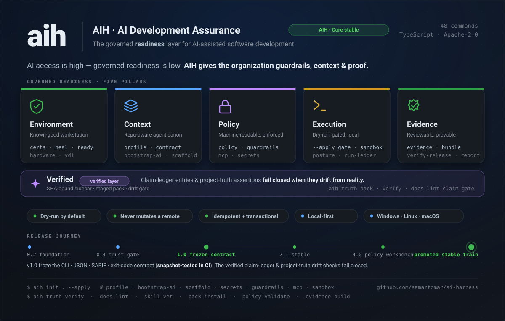
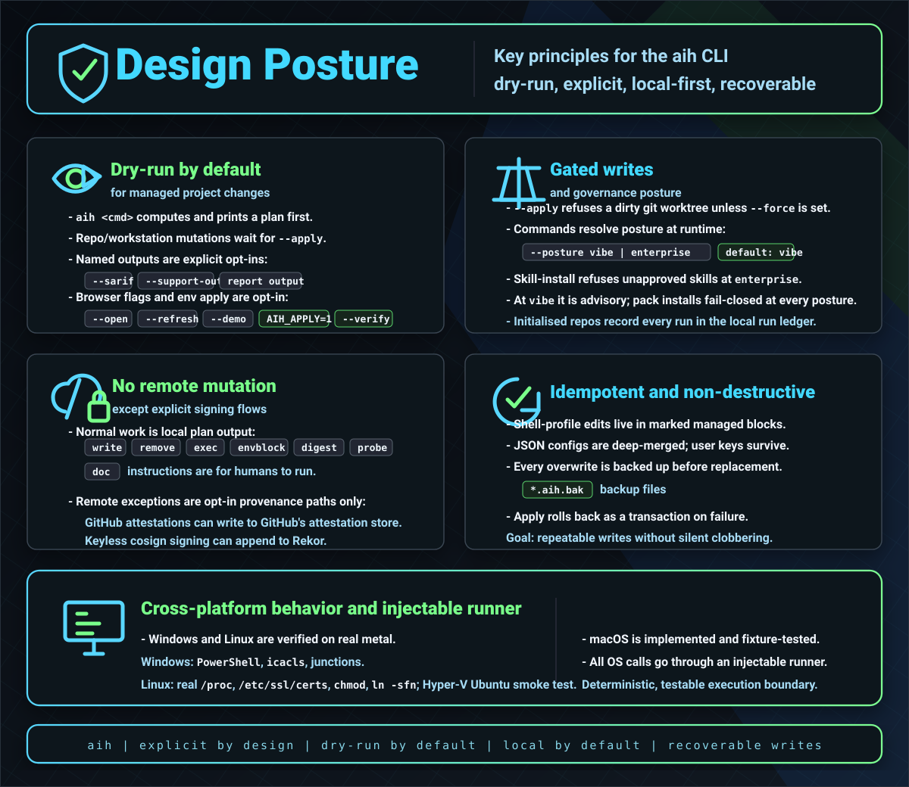
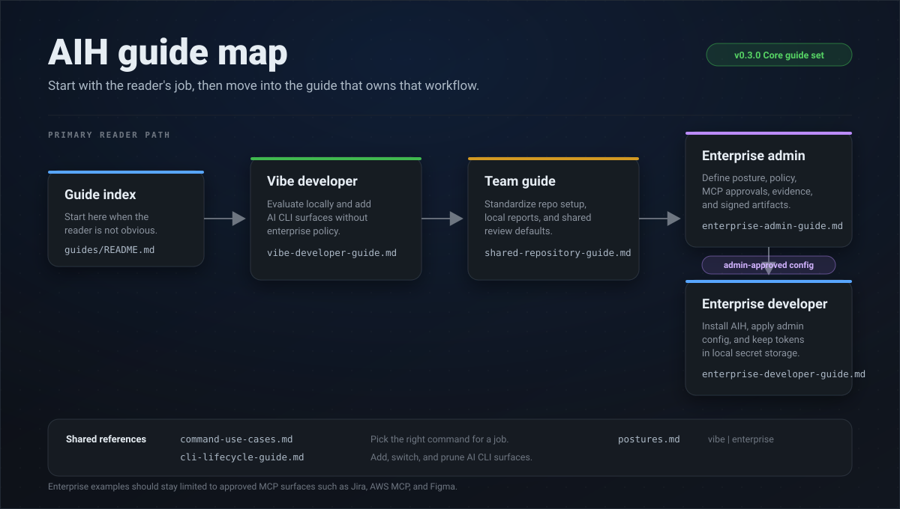
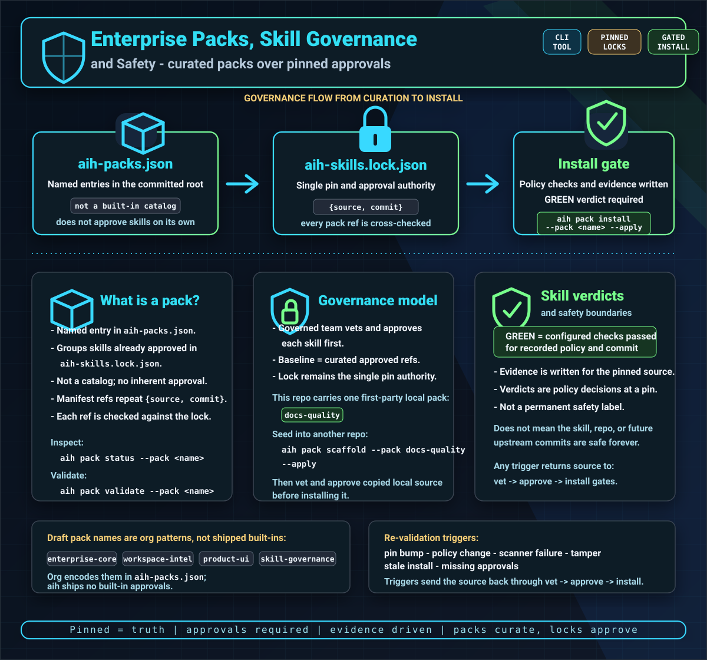
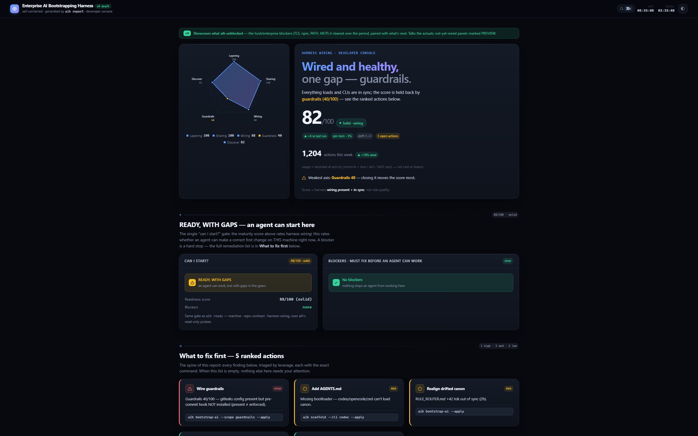

# AIH — AI Development Assurance

[](https://github.com/samartomar/ai-harness/actions/workflows/ci.yml)
[](https://github.com/samartomar/ai-harness/actions/workflows/codeql.yml)
[](https://scorecard.dev/viewer/?uri=github.com/samartomar/ai-harness)
[](https://app.codecov.io/gh/samartomar/ai-harness)
[](LICENSE)
[](package.json)

<p align="center">

</p>

Use the coding agent that fits your workflow. `aih` is a cross-platform CLI that
prepares developer workstations and repositories for **reviewable, governed
AI-assisted coding**, with repository-owned context, supported guardrails,
governed capability workflows, and verification surfaces.

The public product boundary is: **Core governs. Scan produces evidence. Catalog
provides AIH qualification. The organization authorizes.** The package architecture
is Core as `@aihq/core` with the `aih` command, Scanner as `@aihq/scan` with
`aih-scan`, and the Supported Catalog as `@aihq/catalog`. Each repository must adopt
that identity and pass its own exact-SHA publication gate. All local governance state
remains under `.aih/`.

It supports enterprise environments ranging from
locked-down, TLS-intercepted networks to open ones. It extracts corporate trust,
tunes local inference, adds repo guardrails, wires up MCP / observability /
sandboxing, and lays down a tool-agnostic context architecture — all from one
command surface. On top of that setup it runs a governance loop for external
agent skills — vet → approve → pack → marketplace → evidence — anchored in a
committed approval lock (`aih-skills.lock.json`).

See [docs/ARCHITECTURE.md](https://github.com/samartomar/ai-harness/blob/main/docs/ARCHITECTURE.md) for the shipped architecture and
current trust boundaries, and [docs/CONTROL_MATRIX.md](https://github.com/samartomar/ai-harness/blob/main/docs/CONTROL_MATRIX.md) for
the claim -> implementation -> test proof map.

> **Provided as open-source software under Apache-2.0 on an "AS IS" basis.** No warranty,
> support obligation, SLA, indemnity, consulting, or professional advice is provided. `aih`
> is dry-run by default — review the plan before running `--apply`. See [DISCLAIMER.md](https://github.com/samartomar/ai-harness/blob/main/DISCLAIMER.md).

## The stable command contract

The active pre-1.0 package line is `@aihq/core`, starting at `0.1.0`. The previously
published `@aihq/harness@6.1.0` package is frozen and npm-deprecated: use
`@aihq/core` for current AIH. No later AIH release will be published under the
legacy name. The package move adds no wrapper or
alias package and does not rename `aih`, `.aih/`, environment variables, schemas,
receipt identifiers, check codes, or durable state formats.

Every command, flag, and deprecated command alias is
snapshot-tested in CI against a committed fixture, the `--json` envelope is
schema-pinned, and exit-code semantics are pinned — a surface change fails the build
until it ships as a reviewed contract decision. Command renames ship as deprecated aliases
(the old name keeps working, with a one-line warning) before a major removes them,
and security fixes land on the promoted stable train. Release notes say whether an
upgrade is optional, recommended, required by date, or security urgent. The full
policy: [STABILITY.md](https://github.com/samartomar/ai-harness/blob/main/STABILITY.md).

## Design posture

<p align="center">
  
</p>

## Install

The immutable `v-core-0.1.0` attempt passed its read-only verification but npm
refused publication with `EOTP`; that tag and failed run are audit evidence and
must never be deleted, moved, or reused. Resolve the promoted stable version from
npm, approve that exact version under your organization policy, then install and
verify it:

```bash
CORE_VERSION="$(npm view @aihq/core dist-tags.latest)"
npm install -g "@aihq/core@$CORE_VERSION"
aih verify-release "$CORE_VERSION"   # npm signatures, GitHub sums, and cosign evidence
```

The frozen legacy package is npm-deprecated and remains installable only for
existing consumers that have not yet migrated. npm warns those consumers to use
`@aihq/core` instead; new installations should use the active Core line above:

```bash
npm install -g @aihq/harness@6.1.0      # deprecated legacy recovery only
aih verify-release 6.1.0   # checks npm signatures, GitHub release sums, and cosign evidence for 6.1.0
```

Full release verification requires local `npm`, `gh`, and `cosign`; proceed only when all three legs
pass. A skipped leg is incomplete evidence, not a successful rollout gate.

Per-version release notes — what changed, and why — live in
[CHANGELOG.md](https://github.com/samartomar/ai-harness/blob/main/CHANGELOG.md). It ships inside the
npm tarball too, so an evaluator can read the version history straight from the unpacked package.

<!-- aih:claim CM-51 -->
Core library integrations import the strict Package Graph v1 TypeScript schema
from `@aihq/core` and resolve its structural editor schema at
`@aihq/core/schemas/aih-package-graph.schema.json`; no legacy compatibility wrapper is
planned. Existing v6 consumers retain the matching exports under the
npm-deprecated `@aihq/harness` package.
Cross-record checks such as
identity uniqueness, direct-member resolution, and evidence subject binding belong
to the TypeScript parser; graph metadata is never approval or evidence by itself.

<!-- aih:claim CM-86 -->
Core source and package export Strict V2 organization-qualified,
AIH-supported qualification, decision, upstream-artifact manifest, and upstream-observation
contracts, with matching JSON Schemas under `@aihq/core/schemas/`. They let organization evidence and supported-catalog
producers share one exact GitHub/npm/PyPI/OCI/remote subject grammar without making catalog
membership an organization admission. The organization-qualified route binds one canonical,
size-bounded evidence envelope to a current Decision V2 inside verified organization authority. The supported
route accepts only canonical Qualification Receipt V2 bytes after separate GitHub attestation,
then records bounded signer, replay, head, and head-scoped member custody with
`aih policy supported accept --apply`. `aih policy supported inspect` reports a deterministic,
path-scrubbed view of current-head members plus the occupied and remaining retained-member-record
capacity, and fails closed on partial, linked, raced, over-capacity, or foreign state. Superseded
member records remain in custody for replay and audit truth and continue to count toward that fixed
capacity; this route does not prune them automatically.
Receipt V1 is unsupported.

Read governance output as a chain of separate proofs, not as one broad approval:

| Question | AIH surface | Boundary |
| --- | --- | --- |
| Is this the authoritative organization policy? | A current PolicyBundle V2 selected through `AIH_ORG_POLICY`, or the optional separately attested authority receipt | A readable JSON file, Workbench draft, or Catalog entry is not authority. |
| What execution is permitted? | The exact decision target/effect plus a code-owned projector or adapter | Qualification or observation alone does not install, activate, or run a candidate. |
| What independently verifiable evidence exists? | Canonical evidence/qualification receipts, exact digests, custody records, and fresh observations | Catalog membership is provenance; it is not organization admission or live-state proof. |
| Which public claim does that proof support? | [`docs/CONTROL_MATRIX.md`](https://github.com/samartomar/ai-harness/blob/main/docs/CONTROL_MATRIX.md) maps the scoped claim to implementation and named regressions | A passing test supports its named assertion, not general maturity, compliance, or deployment claims. |

Accordingly, reports keep Catalog membership, qualification route (`aih-supported` or
`organization-qualified`), organization authority, durable custody, live observation, and the
effective result distinct. A later failure preserves the established provenance but remains
non-effective; no earlier stage substitutes for a missing later one.

Cold administrators can follow the packed
[exact governance command map](guides/enterprise-admin-guide.md#exact-governance-command-map)
from organization or supported evidence through approval, observation, version update, revocation,
and durable audit inspection. The complete packaged syntax is in
[`aih policy`](docs/commands.md#aih-policy). Catalog-absent Scanner evidence is covered separately in
[Catalog-absent organization detector evidence](guides/enterprise-admin-guide.md#catalog-absent-organization-detector-evidence).

<!-- aih:claim CM-91 -->
For Enterprise, the shortest organization-authority path starts in the generated Policy Workbench.
Run `aih policy generate --apply`, open `aih-policy-workbench.html`, select Enterprise, fill the
protected-file form, and download `aih-policy-bundle.json`. The administrator supplies ordinary
fields for the issuer, an exact GitHub, npm, PyPI, OCI, remote-content, or AIH source identity, artifact kind, targets, effects, and
attributable evidence; the browser computes the canonical Decision V2 source and subject digests.
The administrator does not write JSON. Store the generated **PolicyBundle V2** file at an
administrator-controlled read-only path outside the governed target, then select it with an explicit
`--policy <file>` or `AIH_ORG_POLICY` path. The CLI flag wins when both are present. It contains the ordinary org policy plus the
existing V3 decision-authority payload; no approval workflow or second policy store is required.
Core requires Enterprise posture, bounded strict JSON, a current 90-day-or-shorter authority window,
a regular single-link file reached without symlinked parents, and exact byte re-observation before
effects. Authority-dependent mutating transactions pin those same external bytes. ECC and
Superpowers evidence, ECC request selection, ordinary ECC profile lifecycle acquisition and
mutation, standalone MCP planning, and standalone Usage ownership decisions reuse one verified
policy observation. ECC profile install/update composes projection and native registration inside
one pinned filesystem transaction; receipt-bound uninstall remains independently authorized by
installed custody. Init retains each nested phase's file assertions, deadline, and lock and refuses
a conflicting observation before effects. Child-process effects retain a renewable cooperative
lease and revalidate authority before and after execution; if the latter fails, Core blocks later
effects without claiming it rolled back the already-run child.
Core never writes this file and does
not prove its operating-system ACL: the organization must use an administrator-only directory,
MDM/configuration management, or an equivalent read-only distribution boundary and must control
the process configuration that supplies `AIH_ORG_POLICY`. Replacing the protected file with a newly
issued bundle performs a decision update or revocation; existing Core lifecycle stores retain their
immutable history. On a fresh target with no retained lifecycle state, Core has no separate global
bundle-version high-water mark; the administrator's distribution system must prevent rollback to
older still-valid file bytes. Vibe posture and repo-local `aih-org-policy.json` behavior are unchanged. The
existing fixed GitHub-attested V3 receipt remains an optional higher-assurance/compatibility
transport, not a universal adopter requirement.
Packed library consumers can import `PolicyBundleSchema` and `parsePolicyBundle` from
`@aihq/core` to validate the decoded bundle structure before deployment. Core's active-file reader,
not those object-level helpers, enforces the exact UTF-8 bytes and duplicate-key rules.

<!-- aih:claim CM-89 -->
The `aih policy managed usage-metering` route is one closed AIH-managed
adapter, not a generic plugin registry. `describe` reports the code-derived
`usage-metering` subject, AIH release/source revision, adapter identity, fixed
`configure` effect, and the only supported targets (`claude` and `codex`).
`reconcile [root]` accepts only an exact current Decision V2/digest from verified authority, one canonical
organization-evidence file, and a fixed target. Preview is non-effective and
zero-write; literal `--apply` can write only the fixed recorder, the fixed host
`PostToolUse` entry, the AIH ignore marker, and the strict V4 ownership receipt.
The adapter executes no candidate code and accepts no caller-selected command,
path, source, effect, or adapter. Organization authority can come from the protected
PolicyBundle V2 file above; the optional GitHub-attested receipt transport remains supported.

The V4 receipt records an exact durable claim before configuration, then binds
the verified authority and decision, qualification provenance, subject/source,
target, adapter, effect, ownership observation, and every resulting output.
`inspect` reports absent, transitional, configured, revoked, drifted, or invalid
custody without applying an effect. A current authenticated decision revocation
can subtract only the exact code-derived recorder, hook entry, and ignore marker
after live output validation; the host and ignore documents remain, and their
non-AIH fields and rules are preserved. The self-digested ownership observation
is audit evidence, never deletion authority. Drift preserves disputed bytes, and
revocation makes no process-termination claim. Legacy V1-V3 hook receipts cannot
authorize this route. A later release
whose code-derived source changes must ship an explicit code-owned predecessor
migration; an arbitrary old receipt is never migration authority.

The repository's packed cold-administrator proof installs the tarball in a disposable
consumer and uses a separate protected PolicyBundle V2 file to prove `describe`,
configure, inspect, authenticated revocation, exact byte pinning, and refusal when authority is
missing or changed. It makes no host-ACL claim and does not turn generated test evidence into a
production Scanner signature or Catalog attestation.

`aih policy observe npm-package` selects the qualification route from the exact current decision.
An organization-qualified decision requires `--evidence`; an `aih-supported` decision rejects that
option and instead requires current administrator custody plus the exact re-attested Receipt V2.
Both routes then observe only the exact package name, version, and integrity from a regular npm v3
lockfile and matching installed manifest. The decision fixes the package and `install` effect;
callers cannot select an observer, verifier, runner, clock, receipt, package, or effect. A complete
match returns `observed-effective` and the canonical observation-receipt digest without installing
or executing the package. Structured resolver output reports the exact derived `qualification` as
`aih-supported`, `organization-qualified`, or `unqualified`; it never accepts that provenance from
the caller, and the field does not itself authorize or prove an effect.

<!-- aih:claim CM-87 -->
`aih policy lifecycle npm-package` repeats that complete live
check and can, only with `--apply`, append an immutable content-addressed observation record and
advance its exact subject head under `.aih/governance/npm-package-lifecycle/v1/`. Preview is
zero-write. For an AIH-supported decision, the transaction pins the fixed receipt and exact current
custody records, then performs a full bounded custody re-observation before reporting success. A
later exact version/integrity decision appends a bump instead of rewriting history;
a current authenticated V3 revocation can append a revocation fact but remains non-effective with a
failing, nonzero result and never claims that npm removed or stopped the package. Missing installed
evidence is `partial`; unsafe, changed, stale, rejected,
revoked, mismatched, detectably rolled-back, forked, or detached store state refuses. Only the same
prepared canonical bytes can reuse a completed-record crash orphan; a freshly timed command normally
fails closed on it for operator incident reconciliation. An interrupted immutable-record rename may
also leave its private `.aih.tmp` scratch. A retry consumes it only when its exact candidate bytes and
single-link custody still match at the transaction boundary; mismatched, linked, or foreign scratch is
preserved and refused. A durable subject-and-target claim prevents loss of the
ordinary subject binding from silently admitting a different registry or integration lineage. Apply
writers use one fixed store-wide cooperative lease and an exact-original writer-only capacity guard,
so stale cross-lineage plans cannot race past 256 active lineages, 16,384 aggregate records, or 4,096
records in one lineage. The reader derives those counts independently. A crashed owner becomes
reclaimable after its bounded 30-second mutation window and 30-second recovery grace, while malformed
or foreign lock state blocks.
The inert canonical lock anchor can remain in the store; this is local writer coordination, not an
operating-system lock or protection from a process that can rewrite the store. The target-local chain
blocks lineage substitution while either subject index remains and detects a stale head while its
successor records remain. Coordinated deletion of both the claim and binding, or of a head advance and
all later records, is not detectable without external custody, so administrators must retain the store
in organization-controlled versioned evidence. The internal resolver requires the resulting opaque
qualification capability in addition to the opaque authority and a fresh matching observation; a
decision cannot assert its own qualification.

<!-- aih:claim CM-88 -->
For a governance-owned target, `aih policy evaluate <root> --no-log --json` and the governed report now consume
that fixed lifecycle store as observed state. They validate canonical heads, bindings, and complete
bounded history, then freshly verify current organization authority before classifying each exact npm
package/target lineage as `observed-effective`, `partial`, `withheld`, `refused`, `revoked`, `stale`,
or `drifted`. The observation window is at most 24 hours and is shortened by the authority,
decision, or conditional-review deadline. Every non-effective lifecycle state blocks policy
evaluation and remains explicit in the report. Observation expiry alone does not freeze an unrelated
policy projection; unsafe custody, authority failure, rejection, revocation, and other lifecycle
failures still block projection. This is read-only observation, not a package projector: it performs
no install, update, removal, configuration, execution, or publication and does not make custom stdio
or remote MCP candidates projectable. A store beyond any lifecycle cap is reported as
`over-capacity`, not as corruption, and blocks both evaluation and projection. Administrators retain
the complete store as organization-controlled evidence and reconcile onto a newly governed target
rather than pruning target-local audit history.

<!-- aih:claim CM-90 -->
`aih policy observe upstream-artifact` extends exact observation to an organization-chosen
tool, skill, MCP server, or package that is absent from AIH catalogs and whose files the
organization has already placed in the governed root. A canonical, evidence-bound manifest names
the exact Decision V2 id, subject/source digests, target/effect, accountable integration owner and
contract version, and sorted root-relative file digests. The code-owned observer accepts no
executable, callback, installer, projector, or network override. It validates evidence/manifest
request paths before authority verification, requires single-link evidence custody, and rechecks
authority, evidence, manifest, and every bounded regular file before success. Portable path rules
reject case-fold duplicates, trailing-dot/space and Windows-device aliases, and repeated physical
file identities.

`aih policy lifecycle upstream-artifact` previews with zero writes and, only with `--apply`, appends
content-addressed update or revocation history under
`.aih/governance/upstream-artifact-lifecycle/v1/`. For each current observation record, evaluate and
report reuse its exact evidence/manifest request only to run the fixed read-only observer again, then
re-read the bounded lifecycle snapshot before exposing effective state. Missing or drifted live
inputs and substituted stored identities remain non-effective. Revocation is durable but
non-effective and nonzero. These commands govern exact observed files; they do not install, copy,
configure, activate, remove, stop, or execute them. The packed proof uses installed package bytes and
proves the public parser/schema/commands and the protected-file authority route in a disposable
target. Production deployment still depends on the organization's real administrator-only file
distribution and process-configuration boundary; Core does not certify that host ACL.

<!-- aih:claim CM-86 -->
For an `aih-supported` basis, the administrator first supplies the separately controlled support
repository/workflow roots and applies the exact decision binding to durable custody:

In Policy Workbench, choose **AIH-supported Catalog receipt** as the qualification basis and copy
the exact Catalog signer, Catalog digest, Catalog head digest, and Catalog member digest from the
independently verified Qualification Receipt V2. The Workbench computes and embeds the matching
subject kind and subject digest. The receipt qualifies those exact subject bytes; it does not grant
organization admission or replace the accountable organization approval in the protected file.

```bash
aih policy supported accept \
  --root <governed-target> \
  --decision <exact-decision-id> \
  --decision-digest sha256:<exact-decision-digest> \
  --target <code-owned-cli-id> \
  --apply --json

aih policy supported inspect --root <governed-target> --json
```

The fixed receipt at `.aih/aih-supported-qualification-receipt.json` is evidence only after its
outer attestation, exact decision/subject binding, validity, continuity, and durable head-scoped
member state all pass. The separate organization decision remains the only admission authority.
Inspection lists only members bound to current heads, but its `memberRecords` capacity object counts
all retained member records, including superseded heads. At the fixed capacity, new acceptance fails
closed; preserving and migrating or archiving that administrator store is a separately authorized
operator incident-reconciliation action, not an automatic AIH prune.
The supported-catalog route currently reaches the fixed npm observer/lifecycle. Organization-chosen
tool, skill, MCP, and package files instead use the organization-qualified `upstream-artifact`
observer/lifecycle above. Neither route makes custom candidates projectable or installs, configures,
activates, or executes them. Simulated test attestations are not public verification evidence, and
no real attestation, release, or publication occurs without a separate authorized publication step.

<!-- aih:claim CM-52 -->
`buildPackageGraphIndex` retains every authority claim, preserves identical claims,
and reports divergent definitions without choosing a winner. Its canonical serializer
validates source references, claim and projection digests, and conflict records before
emitting byte-identical JSON. Source-store digests are caller assertions at this
layer; authority adapters are responsible for hashing exact store bytes. The pure
builder performs no I/O and never turns graph metadata into approval or evidence.

<!-- aih:claim CM-53 -->
The exported Package Graph authority adapters hash the exact bytes they parse. They
join the shipped baseline catalog to its evidence lock, enrich exact ECC
materialization receipts, and project strict GitHub skill locks and pack catalogs
without mutating any source store. Discovery classification keeps exact
lock/receipt registrations, catalog-only membership, undeclared immutable residue,
divergence, and unsupported mutable observations separate. GitLab, Bitbucket,
Azure DevOps, and GHES adapters are not implemented.

<!-- aih:claim CM-54 -->
The exported Strix detector contract is separate from static trust scanning. It
pins the verified Strix v1.5.2 source and immutable sandbox image identities,
preflights an operator-installed CLI plus an already-present runnable platform
manifest, and normalizes bounded headless output into strict PoC-redacted evidence.
Org policy can declare local-fixture-only intent with telemetry off and AIH hard
ceilings of $10, 20 turns, and five minutes. `aih evidence build` packages typed
records found under `.aih/security/strix` only after bounded, fatal-UTF-8,
whole-document validation. This foundation performs no scan, image pull, install,
or posture enforcement; publication does not claim AIH executed the detector.
<details><summary>From source (contributors)</summary>

```bash
npm install        # deps
npm run build      # → dist/cli.js  (bin: aih)
node dist/cli.js --help
```
</details>

## Quickstart

```bash
aih doctor              # read-only: is the workstation ready for AI coding?
aih init .              # preview the full repo bootstrap (dry-run — nothing is written)
aih init . --apply      # apply it
```

## Guides by workflow

Use the command reference for exact CLI behavior; use the guides when you need the
right workflow for a reader or rollout stage.



| Reader need | Start here |
| --- | --- |
| Pick the right command for a task | [Command Use Cases](guides/command-use-cases.md) |
| Add, switch, or prune AI CLI surfaces | [CLI Lifecycle](guides/cli-lifecycle-guide.md) |
| Understand posture behavior and boundaries | [Postures](guides/postures.md) |
| Individual developer or evaluator | [Vibe Developer](guides/vibe-developer-guide.md) |
| Shared repository | [Shared Repository](guides/shared-repository-guide.md) |
| Engineering team applying AI-Harness during application delivery | [Enterprise Application Adoption](guides/enterprise-application-adoption.md) |
| Governed organization or enterprise rollout | [Enterprise Admin](guides/enterprise-admin-guide.md) |
| Developer consuming an admin-approved config | [Enterprise Developer](guides/enterprise-developer-guide.md) |

## Command surface

One honest line per command — the long-form behavior detail for every command lives in
[docs/commands.md](docs/commands.md), and `aih <command> --help` is authoritative for flags.
Keep this table as a navigation index: do not add flag-level behavior or workflow recipes here.

### Workstation & runtime

| Command | What it does |
| --- | --- |
| [`aih certs`](docs/commands.md#aih-certs) | Extract the corporate root CA from the OS trust store and propagate trust to npm/pip/cargo/conda. |
| [`aih cleanup`](docs/commands.md#aih-cleanup) | Preview and remove framework-contaminated Claude user-scope surfaces with backup and rollback. |
| [`aih heal`](docs/commands.md#aih-heal) | Diagnose and repair the broken runtime behind any TLS-intercepting proxy — corporate trust, npm, PATH, MCP pre-flight. |
| [`aih tools`](docs/commands.md#aih-tools) | Install the agent shell tools the harness leans on (`rg`/`fd`/`jq`, `ast-grep`, `gh`, …) through the platform package manager. |
| [`aih ready`](docs/commands.md#aih-ready) | Grade a blocker-aware readiness verdict: can a developer start work with an AI agent here, now? |
| [`aih session-guard`](docs/commands.md#aih-session-guard) | Inspect session/action text offline for secret-like values and dangerous local actions. |
| [`aih live`](docs/commands.md#aih-live) | Stream bounded progress from one explicitly selected local Codex, Claude, or opt-in non-read-only Kimi invocation. |
| [`aih hardware`](docs/commands.md#aih-hardware) | Profile CPU/RAM/GPU and emit tuned Ollama/llama.cpp settings. |
| [`aih vdi`](docs/commands.md#aih-vdi) | Detect VDI (Citrix/WorkSpaces/RES/RDP) and redirect caches + SQLite to local scratch. |
| [`aih bootstrap`](docs/commands.md#aih-bootstrap) | Orchestrate the workstation 4-phase rollout (certs → hardware/vdi → telemetry). |

For `aih live`, Codex and Claude use explicit `read_only` modes. The acknowledged Kimi
`non_read_only` path may use native tools and change the selected worktree; aih performs no
worktree-safety or dirty-tree preflight for it. Kimi's required prompt argument is never printed by
aih but can be visible to Task Manager, WMIC, and other local process-inspection tools.
`read_only` describes the pinned core Codex/Claude invocation, not clean-room isolation from every
local extension: Claude skills are disabled, but Claude `--safe-mode` is not used, Codex user
configuration is not wholly ignored, and native instructions/plugins/hooks/MCP configuration may
still initialize under the vendor CLI. Aih does not attest those customizations as read-only.

### Repo canon & bootstrap

| Command | What it does |
| --- | --- |
| [`aih init`](docs/commands.md#aih-init) | Initialize a repo in one pass: profile + superpowers + bootstrap-ai + scaffold + contract + secrets + guardrails + mcp + sandbox + usage. |
| [`aih profile`](docs/commands.md#aih-profile) | Detect the repo's stack recursively and synthesize Cursor stack rules (`.cursor/rules/*.mdc`). |
| [`aih change-profile`](docs/commands.md#aih-change-profile) | Deterministically classify one explicit bounded change-facts JSON file without Git/worktree discovery. |
| [`aih scaffold`](docs/commands.md#aih-scaffold) | Scaffold repo hygiene — secret deny-list, pre-commit hook, `.gitignore` entries; `--canon legacy` adds the full context-doc family. |
| [`aih bootstrap-ai`](docs/commands.md#aih-bootstrap-ai) | Emit and verify the repo's Layer-2 canon — `RULE_ROUTER.md`, per-CLI adapters, root bootloaders; `--verify` is the drift gate. |
| [`aih contract`](docs/commands.md#aih-contract) | Synthesize the machine-readable repo contract (`project.json`) from the detected stack. |
| [`aih capability`](docs/commands.md#aih-capability) | Resolve repo capability needs; inspect or preview policy-driven packages; explicitly reconcile already-promoted, approved GitHub skill packs. |
| [`aih adopt`](docs/commands.md#aih-adopt) | Converge an existing AI canon onto aih's managed model without overwriting your work (brownfield migration). |
| [`aih prune`](docs/commands.md#aih-prune) | Remove stale per-CLI artifacts and reconcile orphaned aih-managed ECC components from the machine registration ledger. <!-- aih:claim CM-22 --> |
| [`aih uninstall`](docs/commands.md#aih-uninstall) | Remove the marker-backed core aih install footprint from a repo; `aih clean` is an alias. |
| [`aih ecc`](docs/commands.md#aih-ecc) | Register the additive ECC union, manage the reviewed Claude/Codex projection with `--lifecycle`, or explicitly add/remove policy-approved ECC HTTPS MCP entries for one selected native client with `aih ecc mcp add/remove`. In a governed repository, `--lifecycle install` materializes the org policy's evidence-passed selection for the targets `--cli` selects, including the separately evidence-bound Kiro skill/steering projection; removal lives in `aih uninstall`. <!-- aih:claim CM-21 --> <!-- aih:claim CM-45 --> <!-- aih:claim CM-50 --> <!-- aih:claim CM-55 --> |
| [`aih superpowers`](docs/commands.md#aih-superpowers) | Verify exact-pinned Superpowers components and emit evidence-bound target guidance. |
| [`aih crispy`](docs/commands.md#aih-crispy) | Run the CRISPY context-engineering stage machine (deterministic, gate-ordered). |
| [`aih workspace`](docs/commands.md#aih-workspace) | Scaffold and restore a multi-repo workspace at the parent folder: cross-repo map, declared-repo graph MCP, snapshots, hydrate. |

### Skill governance & supply chain

| Command | What it does |
| --- | --- |
| [`aih trust`](docs/commands.md#aih-trust) | Vet, pin, and gate external GitHub repos and skills before an agent acquires them. |
| [`aih skill`](docs/commands.md#aih-skill) | Govern the skill lifecycle — vet → approve → inventory → quarantine → remove — anchored in `aih-skills.lock.json`. |
| [`aih pack`](docs/commands.md#aih-pack) | Curate committed sets of approved skills (`aih-packs.json`); every ref is cross-checked against the lock, fail-closed. |
| [`aih marketplace`](docs/commands.md#aih-marketplace) | Build, validate, and publish a reproducible, verifiable distribution artifact for hostable approved skills — never a registry. |
| [`aih policy`](docs/commands.md#aih-policy) | Generate the Policy Workbench and its protected Enterprise authority file; resolve protected-file or optional attested V3 authority plus exact organization evidence; observe and persist governed lifecycles; evaluate, project, validate, or verify policy. |
| [`aih evidence`](docs/commands.md#aih-evidence) | Vet exact-pinned baseline components and package local audit artifacts into deterministic signed evidence bundles. |
| [`aih truth`](docs/commands.md#aih-truth) | Create and verify an external project-truth sidecar; commit, version, claim, decision, acceptance-preflight, and agent-evidence assertions fail closed before a pack helps govern evidence. <!-- aih:claim CM-13 --> |
| [`aih bundle`](docs/commands.md#aih-bundle) | Build a deterministic fleet bundle with checksums; `aih verify-bundle --require-signature` turns missing/unverifiable signatures into failures. |
| [`aih verify-bundle`](docs/commands.md#aih-verify-bundle) | Re-check a fleet or evidence bundle's checksums and signature/provenance evidence. |
| [`aih verify-release`](docs/commands.md#aih-verify-release) | Verify a published aih release: npm signatures, GitHub release cosign bundle, and tarball hash. |
| [`aih secrets`](docs/commands.md#aih-secrets) | Scan for plaintext secret paths and hardcoded MCP config credentials without emitting values; `--verify` is warning-only at `vibe` and non-zero at `enterprise`. <!-- aih:claim CM-16 --> |
| [`aih guardrails`](docs/commands.md#aih-guardrails) | Generate local gitleaks/pre-commit policy files and a CI license/secret workflow; enforcement requires installing tools and wiring Git hooks or required CI checks. <!-- aih:claim CM-17 --> |

### Enterprise packs, skill governance, and safety

<p align="center">
  
</p>

### Trust configuration notes

`trust.internalScopes` is intentionally inert until an org configures internal package scopes in
policy. Without that scope list, dependency-confusion checks still report general package risk but do
not guess which names are private to your organization.

### Baseline component evidence

`aih ecc` and `aih superpowers` acquire only exact Git commits into quarantine. Selected component
paths must match the vendor lock shipped in the npm release or an attributable GitHub-attested org
bundle. Covered user seats verify hashes and signatures; they do not rerun the release analyzers.
Missing/mismatched coverage warns without an authorization receipt at `vibe` and denies at
`enterprise`. A signed `blocked` verdict denies at every posture and cannot be waived by org
evidence for the same bytes. See [Baseline Component Evidence](https://github.com/samartomar/ai-harness/blob/main/docs/security/baseline-evidence.md)
for the vet/sign/policy flow. <!-- aih:claim CM-20 -->

### Analytics & operations

| Command | What it does |
| --- | --- |
| [`aih report`](docs/commands.md#aih-report) | Render the read-only analytics digest — context footprint, adoption, governed-subject review, trends; `--v9`/`--open` build the offline HTML dashboard. |
| [`aih track`](docs/commands.md#aih-track) | Record one metrics sample (commits, LOC delta, adoption) to `.aih/history.jsonl` — the time-series behind `aih report` trends. |
| [`aih usage`](docs/commands.md#aih-usage) | Install the multi-tool usage-capture layer → `.aih/usage.jsonl` — local activity counts only, no cost, no prompts. |
| [`aih telemetry`](docs/commands.md#aih-telemetry) | Inject OpenTelemetry env, a redacting Bindplane collector, and an analytics fetcher. |
| [`aih mcp`](docs/commands.md#aih-mcp) | Generate MCP config for targeted CLIs; a bare first run stays on Claude, while `--detect` explicitly selects runnable tools. Use `--mcp-compliant` to omit denied generated servers from targeted configs. <!-- aih:claim CM-18 --> |
| [`aih sandbox`](docs/commands.md#aih-sandbox) | Generate a devcontainer + managed sandbox settings (egress allowlist, `failIfUnavailable`). |

### Verification

| Command | What it does |
| --- | --- |
| [`aih docs-lint`](docs/commands.md#aih-docs-lint) | Run the read-only BetterDoc prose check and claim-ledger gate over public Markdown; hard claim orphans fail closed, while prose guidance is advisory. <!-- aih:claim CM-12 --> |
| [`aih doctor`](docs/commands.md#aih-doctor) | Verify the workstation/repo configuration fail-closed; workspace mode validates each child repo, and Enterprise posture attests declared capability surfaces. |
| [`aih governance-doctor`](docs/commands.md#aih-governance-doctor) | Present the shipped Governance Doctor Audit and Guide read-only and zero-write; it runs bounded read-only diagnostics while the guided next action stays descriptive and no mutation is executed. <!-- aih:claim CM-65 --> |
| [`aih repair`](docs/commands.md#aih-repair) | Preview and, with exact local TTY digest confirmation, apply the one code-owned `ai-coding` repair when its live branded precondition is eligible; indeterminate occupancy refuses distinctly before consent, while `aih governance-doctor --repair-plan` remains preview-only (`executable: false`). A verified effect with a partial fresh Audit reports qualified success. <!-- aih:claim CM-74 --> |
| [`aih status`](docs/commands.md#aih-status) | Show a read-only inventory of what the harness has configured. |

Shared flags: `--apply`, `--force`, `--verify`, `--json`, `--posture <vibe|enterprise>`, `--support-out <dir>`, `--no-log`, `--context-dir <dir>`, `--root <dir>`, `--policy <file>`, `--cli <list>`, `--all-tools`, `--detect`, `--yes` (read-only commands take the relevant subset). `--policy` selects one explicit organization-policy JSON or PolicyBundle for the invocation; it overrides `AIH_ORG_POLICY` and the default repo-local `aih-org-policy.json` lookup.
Settings also read from `AIH_*` env vars (`AIH_APPLY`, `AIH_CONTEXT_DIR`, `AIH_LOG`, …).

### Plugins

At startup `aih` probes for exactly one optional peer package: **`@aihq/enterprise`** — the literal
name, never env- or config-selectable, so nothing can point the probe at other code. The package name
is a reserved extension point; the open-source harness does not require it to be published. When installed,
it contributes additive enterprise command capabilities through its `aihCommands` export
(`CommandSpec[]`) as defined in the
[enterprise extension point spec](https://github.com/samartomar/ai-harness/blob/main/docs/product/enterprise-extension-point.md). Those commands register
as native subcommands through the identical path as the built-ins: shared flags, posture resolution,
the dirty-worktree gate, and the run ledger all apply unchanged. Not installed → zero output, fully
local. `AIH_NO_PLUGINS=1` disables the
probe. A plugin that fails to load, exports the wrong shape, or ships an invalid spec degrades to
local-only with a one-line `aih: plugin:` warning on stderr — and a plugin command can never shadow
a built-in (built-ins always win). Installing the plugin package **is** the trust decision:
importing it runs its code, exactly like any other dependency you install.

The probe is hardened at its seams. The package must resolve from **the install tree `aih` itself
runs from** (the `node_modules` chain above the aih binary), so a global or `npx`-run `aih` pointed
at an untrusted repo never imports a `node_modules/@aihq/enterprise` planted inside that repo.
Honesty note: when aih is installed *inside* the target repo, the repo already controls the binary
itself — the boundary is exactly "the tree aih runs from", nothing stronger. The import also races
a 2-second startup budget (timeout → local-only with a warning), and `aih --version` skips the
probe entirely. Plugin specs cannot claim shared or reserved flags (`--apply`, `--json`, `--help`,
…), cannot take the names `help`/`version`, and alias fields plus any `skipWorktreeGate` field are
stripped — aliases are core-owned and the dirty-worktree preflight always applies to plugin commands.

### Dashboard

`aih report --open` builds a **self-contained, offline** HTML dashboard (dark by default with a
light toggle; fonts embedded) — context footprint + a KPI strip, an adoption ring, output-velocity
and code-quality panels, and trend sparklines from recorded history (`aih track`). Add `--v9` for
the newer developer-console dashboard: every panel is explicitly LIVE, PREVIEW, or EMPTY, so demo
data never reads as real. When the report derives findings (see [Support tickets](#support-tickets)),
a **Suggested actions** section leads with copy-to-clipboard tickets. Add `--demo` for showcase data,
or `--refresh <sec>` to keep it live.

The local digest also includes a governed-subject review. With governed policy it keeps effective,
decision, and receipt facts separate from bounded usage attribution: an explicit MCP-server identity
never falls back to a name heuristic, unique name matches remain partial attribution, and routine
non-subject activity is counted separately from unknown or ambiguous subject evidence. Names never
render. Non-effective subjects say `not-projected` and keep any surface-wide receipt explicitly
separate; no local counter becomes a value, revocation, retirement, or uninstall recommendation.
Absent, invalid, or non-governing policy is an explicit redacted unavailable state.



*The `--v9` developer console with `--demo` showcase data: harness-wiring score, ranked
fix actions, and the remediation ledger. This image uses demo/local data, not customer
telemetry. `aih report --demo --v9` opens the same dashboard locally.*

### Targeting CLIs

`aih ecc`, `aih superpowers`, and `aih bootstrap-ai` only touch the agent CLIs you actually use.
Pass `--cli` with a comma-separated list, `--all-tools` for every supported CLI, or `--detect` to
auto-target the CLIs found on this machine; the default is `claude`. Supported:
`claude, codex, cursor, antigravity, gemini, copilot, windsurf, opencode, zed, kimi, kiro`.
At Enterprise posture, an org policy must declare a non-empty `governance.supportedClis` allow-list. Its absence fails closed and names the current registry ids so an administrator can deliberately paste the full list; wildcard sentinels are not supported. At Vibe posture, absence is unrestricted. A present list at either posture is an organization sanction gate: selected, detected, or marker-derived CLI targets outside it are refused by name before later capability checks, materialization, or projection.

```bash
aih bootstrap-ai --cli claude       # writes CLAUDE.md (the default target, auto-loaded)
# repeatable declarations add to detection and the prior machine union
aih ecc --cli claude,codex --with framework:react --with lang:typescript
aih superpowers --cli antigravity   # verify exact pin; guidance only (no mutable plugin exec)
aih bootstrap-ai --cli kiro --kiro-hook-runtime ide1-cli3  # Kiro IDE1/CLI3 hooks opt-in
aih bootstrap-ai --detect           # target only the CLIs installed here
aih init . --all-tools              # bootstrap a repo for every CLI at once
```

Each CLI gets its native entry: **Claude → `CLAUDE.md`** (the default target, auto-loaded),
Codex/OpenCode/Zed/Kimi/Antigravity → `AGENTS.md`, Gemini → `GEMINI.md`, Cursor →
`.cursor/rules/*.mdc`, Windsurf → `.windsurfrules`, Copilot → `.github/copilot-instructions.md`,
Kiro → `.kiro/steering/00-canon.md` (`inclusion: always`, with a `#[[file:…/RULE_ROUTER.md]]`
live-reference). For a tool aih doesn't target yet, `<context-dir>/adapters/other-tools.md`
documents how to point it at `RULE_ROUTER.md`.

**Per-tool depth (Kiro example).** Claude reuses your `~/.claude` baseline, so its entry is just
`CLAUDE.md`. Tools that can't read `~/.claude` get fuller native content instead — Kiro is the
deepest case (schemas verified against [Kiro's docs](https://kiro.dev/docs/steering/) and ECC's
real `.kiro/` tree):

- `aih bootstrap-ai --cli kiro` → `.kiro/steering/agent-tools.md` (stack-aware CLI usage).
  Add `--kiro-hook-runtime ide1-cli3` to project standalone v1 `.kiro/hooks/*.json` hooks for
  secret scan, tests-on-edit, and metrics-on-stop; the explicit capability is persisted for doctor.
  Those hook files load in Kiro IDE 1.x and Kiro CLI 3.x. Kiro CLI 2.x keeps hooks inside each
  custom-agent definition, so AIH does not mutate an arbitrary agent or claim hook coverage there.
  A pre-existing reserved hook filename is never overwritten, and prune/uninstall leave current or
  legacy hook names advisory because a filename alone cannot prove AIH ownership.
- `aih bootstrap-ai --detect` recognizes the documented `kiro-cli` executable. The public target
  remains `kiro`; bare `kiro` is not treated as proof of the CLI because it can be an IDE/CLI router.
- `aih adopt --migrate-cli` inventories Kiro steering, hooks, custom-agent definitions, skills,
  prompts, settings, and specs. Every `.kiro/agents/**` definition, including Markdown, remains
  operator-owned runtime configuration; steering, skills, prompts, and specs can move into the canon.
- `aih policy project` can distribute reviewed stdio MCP selections to
  `.kiro/settings/mcp.json` under receipt ownership of exact server names. It preserves unrelated
  workspace configuration and never calls that managed enforcement: custom agents may override or
  opt out of workspace MCP inheritance.
- `aih ecc --cli kiro` → emits scoped consult guidance; Kiro's native installer cannot yet
  materialize the component union safely, so aih does not run it.
- In a governed repository, `aih ecc --lifecycle install --cli kiro` is a separate AIH-owned
  path: it projects only evidence-passed selected agents with an exact pinned Kiro mapping, skills,
  and steering from the exact pinned source, under dual selected/runtime evidence and receipt
  ownership. A mapped agent lands as its exact selected `.kiro/agents/<name>.md` IDE representation
  and curated `.kiro/agents/<name>.json` CLI configuration; an unmapped agent is reported by name,
  while a pre-existing same-name Markdown/JSON definition, including a
  case-folded spelling on a case-sensitive filesystem, is refused rather than overwritten. It does
  not run or adopt the native installer or project hooks/settings/scripts.
- `aih superpowers --cli kiro` → `.kiro/steering/superpowers-methodology.md` (the
  brainstorm → plan → TDD → review routing, since Kiro can't load `~/.claude/superpowers`).

<!-- aih:claim CM-58 -->

**Detection** (`--detect`) targets runnable CLI binaries on PATH — and it is the *only* thing that
does. Nothing on your machine changes what a bare run targets: runnable binaries need `--detect`,
and config dirs (`~/.claude`, `~/.codex`, `~/.gemini`, `~/.cursor`, `~/.kiro`, …) are reported as
config-only traces that are advisory, may be stale, and never drive setup unless you type the CLI
with `--cli` or `--all-tools`. Precedence: `--all-tools` > `--cli` > `--detect` > committed marker >
default `claude`. When `--detect` finds no runnable CLI it defaults to `claude` and says so; a bare
run that defaults to `claude` while the repo already has other bootloaders (`AGENTS.md`, …) says
that too, naming the files it will not regenerate or drift-check. **In an interactive terminal,
`--detect` shows the runnable list and any config-only traces
before asking you to confirm or edit it** (press Enter to accept, or type a comma-separated list to
add/remove tools) before anything installs — pass `--yes` (or run non-interactively / piped /
`--json`) to skip the prompt and use the runnable list as-is. `aih doctor` reports runnable vs
config-only CLIs, and `aih bootstrap-ai --verify` adds a per-CLI **"installed"** confirm step (pass =
runnable binary on PATH, skip = config-only/not here yet, bootloader still written) alongside the
drift gate.

**Canon directory name.** Every generated file and reference adopts `--context-dir <name>` — use any
name you like; the default is the visible `ai-coding/`:

```bash
aih init                          # → ai-coding/   (default, visible)
aih init --context-dir my-canon   # → my-canon/    (any name; everything adapts)
aih init --context-dir .ai-context  # → hidden, the old default
```

ECC install actions execute under `--apply` only after exact component evidence clears and the same
quarantined tree re-hashes. By default, `aih ecc` materializes the additive union of its common
baseline, detected or repeatably declared project riders, posture-selected security, and validated
MCPs; `--profile full` is the explicit full-surface opt-in. Evidence verdicts apply per component:
authorized components install, while held components are quarantined and reported with their exact
codes and reasons. No install process starts unless ECC's installer runtime is also authorized.
The project contribution keeps the requested intent, while each target record contains only the
surface actually installed. The primary project/target contribution ledger lives at
`~/.aih/ecc/registration-ledger.json` and commits only after every install step succeeds. A bare
`aih prune` also checks that ledger: missing project roots are retired, the live
component/MCP union is recomputed, and only state-recorded aih-managed operations no longer shared
by a live project are removed. Dry-run reports the diff without mutation; `--apply` hash-binds all
inputs, rolls back partial failure, and replaces target state before committing the ledger last.
Superpowers marketplace/TUI paths cannot bind installed bytes to that
tree, so aih executes none of them; it emits pin-aware guidance and says those marketplace selections
are not evidence-covered. ECC and Superpowers are complementary — ECC supplies stack-aware rules,
agents, and memory; Superpowers supplies the disciplined agent loop that uses them.
For Codex, installed ECC skills are consumed on demand by name, such as `$configure-ecc`, from the
literal Codex skills path (`~/.codex/skills/<name>/SKILL.md`); they are not an ambient auto-loaded
`.agents/skills/` surface. `aih ecc --cli codex` still installs the selected ECC Codex
skills/agents from ECC's manifest, but uses add-only Codex TOML merge helpers and a fenced AGENTS
merge rather than the upstream `ecc-install --target codex` copy mode for shared `~/.codex` files.
Its scoped MCP block contains pinned `sequential-thinking` plus GitHub at enterprise (and
repo-declared local graph/memory servers); Context7 and Exa are never defaults.

For ECC's separate external MCP catalog, `governance.eccMcpApprovals` is only a seat approval record.
An operator still performs an explicit Add when a project needs one approved HTTPS entry:
`aih ecc mcp add memxus --cli claude --apply`. That path writes project-local JSON client configs for
Claude, Cursor, Copilot, Kimi, and Kiro; guarded global JSON configs for Antigravity, Gemini, Windsurf,
OpenCode, and Zed; and guarded Codex TOML. It records ownership under `.aih/`, removes only unchanged
receipt-owned entries with `aih ecc mcp remove <id> --cli <client> --apply`, and doctor reports local
receipt/config ownership state. It does not contact the endpoint, scan the remote tool list, or install all
approved entries.

The portable Policy Workbench uses a flat Ledger paper-and-ink identity in light and dark themes. Its left
rail suggests aggregate choices, while the center inventory remains final authority for individual Agent and
Skill rows; the inspector is mutation-free, narrates the selected-to-materialized journey, and offers one routed
next action. Its source-locked planes show all 286 canonical ECC skills and all 35 entries in ECC's pinned MCP
source. Every exact Skill row authors reversible, source-bound requested intent against an independently
scannable baseline subject. Selection alone still grants no evidence, approval, installation,
materialization, or support; the governed lifecycle remains held until exact evidence clears. The 31
ECC-owned MCP entries route to approval authoring, while the
four AIH-owned declarations remain read-only availability and do not imply that Core ships a matching control.
The Artifacts workspace creates one intake and one scanner evidence bundle for up to 100 mixed items, then can
save the draft policy, intake, and evidence history in one resumable, explicitly non-authoritative team review
workspace. The deployable protected policy remains a separate download. At Enterprise posture, the
protected-file form is the administrator-facing authority authoring surface: it accepts structured exact-source
and evidence fields, computes the existing Decision V2 digests, and downloads the existing PolicyBundle V2
without exposing editable raw JSON. Curation and custom-source forms live in a separate authoring sidebar. The
separate Add MCP sidebar records the exact `governance.eccMcpApprovals` decision; it does not choose a client or
configure one. For an entry marked HTTPS-configurable, the seat operator still selects one client explicitly
with the command above; manual entries remain approval-only until a supported lifecycle exists.

The Workbench also shows the first bounded adoption recipe for Token Savior, Serena,
code-review-graph, codebase-memory-mcp, and Token Optimizer. It assigns one question class to each
role and states the prerequisite, overlap boundary, supported next route, and locally captured usage
signal without adding an inventory row or selection control. This is inert guidance: it neither
approves nor installs anything, changes no exported policy bytes, and is not a generic recipe or
catalog-distribution plane.

The Workbench also authors source-locked ECC hook controls: Minimal, Standard, or Strict profile selection and eligible per-hook disables. Policy projection records those choices only as receipt-owned `ECC_HOOK_PROFILE` and `ECC_DISABLED_HOOKS` keys in Claude `settings.json.env`; it never rewrites ECC launchers. ECC executes and enforces the selection after process spawn, so disabling a hook does not erase its spawn cost.

The Workbench can also import one standalone `GovernanceDecisionV1` for inspection and canonical download. It applies the strict decision grammar and semantics, keeps the record separate from policy and receipt state, renders its untrusted fields as text, and labels it unverified and not effective. This is an inert transport view: it cannot edit, verify, sign, fetch, resolve, project, or materialize the decision, and importing one never grants approval or changes the authored policy.

### Layered AI canon (`bootstrap-ai`)

The harness models the same two-layer setup used in the reference repos (eicp / ai-os / syntegris):

- **Layer 1 — user baseline:** `--baseline ecc` — the default and sole selectable baseline
  (ECC + Superpowers installed per CLI by `aih ecc` / `aih superpowers`).
- **Layer 2 — repo canon:** the committed `ai-coding/` (or `--context-dir`) tree — `RULE_ROUTER.md`
  (stack-aware routing entry point), the contract files `project.json`, `project.md`, and `setup.md`,
  `adapters/<cli>.md` (per-tool wiring notes), and the root **bootloaders** (`CLAUDE.md`, `AGENTS.md`,
  `GEMINI.md`, Cursor/Windsurf/Copilot). `REGENERATION.md` is emitted only for `--canon legacy`.

`aih bootstrap-ai` generates and verifies Layer 2. Each bootloader is hand-editable tool-specific
content **plus one marker-delimited shared block** that `bootstrap-ai` regenerates idempotently —
your edits outside the markers survive (merged in, with an `.aih.bak` backup). `aih bootstrap-ai --verify`
is the **drift gate**: it fails if the router is missing or a bootloader's block has been hand-edited
away from the canonical source — wire it into CI to keep every tool's entry point in sync.

```bash
aih bootstrap-ai --all-tools --apply   # lay down RULE_ROUTER + adapters + bootloaders for every CLI
aih bootstrap-ai --verify              # CI drift gate (no writes; exit 1 on drift)
```

Precedence: **Layer 2 wins** on conflict — repo canon overrides the generic baseline. Run
`aih contract` to refresh the contract files the compact router points at.

### Multi-repo workspaces

Most orgs split a product across **separate repos** (a UI repo and a backend repo in one git org). An
agent editing the UI then has no view into the backend — no cross-repo blast radius. `aih workspace`
is a federated bridge, not a monorepo replacement: the child repo owns truth, and the parent workspace
owns routing, contract edges, snapshots, MCP wiring, and report rollups. It bridges that gap from the
**parent folder** that holds the repos:

```bash
aih workspace ./my-org --repos ui,backend --apply
```

It writes, at the parent (it does **not** touch the child repos — run `aih init` in each):

- `<context-dir>/cross-repo-architecture.md` — per-repo responsibilities + a **cross-repo feature map**
  (UI column · backend column · the contract). **Write-once** — aih seeds it from your repo list, then
  you own it; re-running never overwrites it.
- `<context-dir>/repo-discipline.md` — load a repo's own canon before editing it.
- Targeted CLI bootloaders — `CLAUDE.md` by default; `--cli`/`--all-tools` can add
  `AGENTS.md`, `GEMINI.md`, `.kiro/steering/00-canon.md`, and other tool-native entries.
- `<name>.code-workspace` — opens every repo in one VS Code window.
- `.mcp.json` — one **code-review graph MCP** per present declared child repo, using absolute
  root-anchored child paths so MCP clients work from any launch directory.
- `.aih-workspace.json` — marker that puts `aih doctor` into **workspace mode** (validates each child
  repo is scaffolded); object-form repos can retain optional `remote`/`ref` source metadata.
- Child repos are an explicit allowlist: use `--repos` or an existing `.aih-workspace.json`. If child
  Git repos are present without an allowlist, `aih workspace` reports candidates but does not add them
  to `.aih-workspace.json` or workspace MCP scope.
- `aih workspace snapshot --lock --apply` writes the recorded child remote into
  `<context-dir>/workspace-lock.json` when present, so a lock captures both the commit and fetch
  location. A manifest-declared `remote` takes precedence; otherwise snapshot collection reads only
  child-local `origin` config and never fetches.
- `aih workspace hydrate --apply` restores a declared workspace from `.aih-workspace.json` plus the
  committed workspace lock: missing children are cloned from recorded remotes, present clean children
  are checked out to the recorded ref, and children with no recorded remote are skipped with a note.
  Until a declared child exists, `aih workspace --apply` skips that child's graph MCP scope and emits
  a hydrate note instead of wiring an empty path.
- `aih workspace graph` projects the **declared** contract edges into a queryable cross-repo graph:
  `--repo`/`--from`/`--to`/`--kind` answer "what depends on what" from `.aih-workspace.json` alone,
  and `--apply` writes the projection to `.aih/workspace-graph.json`. Declared topology is the source
  of truth — the per-repo graph MCP servers are optional enrichment, never required.

### Support tickets

Any verifying command (`aih doctor`, `aih heal`, `aih secrets --verify`, …) turns a failed or skipped
check that carries a `Check.code` into a ticket-ready support template — three registers keyed off who
fixes the issue, and external tickets are tool-neutral by contract (they never name aih). Labels print
by default; `--support-out <dir>` writes full tickets, `--json` carries them. Registers, redaction, and
the `SETUP.md` context markers: [docs/commands.md](docs/commands.md#support-tickets).

### Run ledger

Every `aih` invocation appends one structured row to **`.aih/runs/YYYY-MM.jsonl`** (UTC, month-sharded,
append-only) — a "what happened" diagnostics trail: schema version, run id, capability, redacted argv,
status (`success` / `failed` / `partial` / `error`), exit code, mode (apply/verify/json/sarif), platform,
host hash, repo remote hash, write tally, and verification + support counts. It's distinct from
`.aih/history.jsonl` (the per-commit metrics behind `aih report` trends). Logging is **on only after the
repo is initialised** (a committed `.aih-config.json` marker exists) and never fails a command; opt out
with **`--no-log`** or **`AIH_LOG=0`**. Like all of `.aih/`, the ledger is gitignored local diagnostics
— never committed. `aih evidence build` packages it into a checksummed bundle; use
`aih evidence build --sign <signer> --require-signature` when the bundle crosses a
sharing boundary that requires tamper evidence.

### Examples

```bash
aih doctor --json                 # what's configured? (read-only)
aih init . --apply                # bootstrap the current repo
aih certs --ca-pattern Zscaler --apply --verify
aih hardware                      # preview the tuned inference env block
AIH_CONTEXT_DIR=ai-coding aih scaffold --apply
aih doctor --support-out .aih/tickets   # write IT/support tickets for failing checks (kept local)
aih report --v9 --apply --out .aih/reports/local-v9.html
aih usage --apply --cli claude,codex,gemini
aih usage --rollup ../repo-a,../repo-b
```

## Releases & roadmap

- **Roadmap** — [ROADMAP.md](https://github.com/samartomar/ai-harness/blob/main/ROADMAP.md), tracked as
  [GitHub Milestones](https://github.com/samartomar/ai-harness/milestones).
- **Changelog** — [CHANGELOG.md](CHANGELOG.md); tagged builds on
  [Releases](https://github.com/samartomar/ai-harness/releases).
- **Versioning & support** — [VERSIONING.md](https://github.com/samartomar/ai-harness/blob/main/VERSIONING.md). SemVer; security fixes
  land on the **promoted stable train**, and release notes state the required adoption action.
- **Supply chain** — the Core release workflow is configured to publish via npm **Trusted Publishing** with build
  **provenance** and ships an **SPDX SBOM**, a **SHA256 checksum**, its keyless **cosign
  signature bundle** (`SHA256SUMS.txt.sigstore.json`), and the Sigstore **build-provenance
  bundle** on the GitHub Release. Candidate build and smoke execution stay in a read-only job;
  the protected publication job verifies the workflow-artifact digest, original tarball digest,
  and packed identity without executing Core package code. Tokenless npm Trusted Publishing is the
  steady-state publication path, and the workflow fails closed unless the exact binding documented in
  [RELEASING.md](RELEASING.md) remains present and matches. Releases from `v0.6.0` onward include
  the sigstore/provenance assets; earlier historical tags have a narrower asset set. The tagged Core tarball
  claims [SLSA Build L2](https://github.com/samartomar/ai-harness/blob/main/docs/security/release-slsa.md)
  under SLSA v1.2; the other Release assets are supporting evidence, not additional L2 subjects,
  and no Build L3 claim is made. Verify a published release with `aih verify-release [version]`; a skipped verification leg
  is incomplete evidence. Consumers with provenance-aware policy can also use `gh attestation verify`.
- **Support** — [SUPPORT.md](https://github.com/samartomar/ai-harness/blob/main/SUPPORT.md) · **Security** — [SECURITY.md](https://github.com/samartomar/ai-harness/blob/main/SECURITY.md)
  (private reporting) · **Contributing** — [CONTRIBUTING.md](https://github.com/samartomar/ai-harness/blob/main/CONTRIBUTING.md).

## Development

```bash
npm test          # vitest
npm run typecheck # tsc --noEmit
npm run lint      # biome
npm run build     # tsup → dist/
```

Stack: TypeScript (ESM) · commander · zod · vitest · biome · tsup. Coverage floors
are enforced in [vitest.config.ts](https://github.com/samartomar/ai-harness/blob/main/vitest.config.ts) — set just below the achieved
levels so coverage only ratchets up; CI and releases fail on regression. See
[CONTRIBUTING.md](https://github.com/samartomar/ai-harness/blob/main/CONTRIBUTING.md) for the contributor workflow.

### Stability

The tests behind [the stable command contract](#the-stable-command-contract) live in
[tests/contract/](https://github.com/samartomar/ai-harness/tree/main/tests/contract): every command and option is snapshotted against a
committed fixture ([command-surface.json](https://github.com/samartomar/ai-harness/blob/main/tests/contract/command-surface.json)), the
`--json` envelope is schema-pinned, and exit-code semantics are pinned. Additive changes
regenerate the fixture in the same PR (label it `contract:additive`); removals or renames
of anything pinned are breaking and ship in majors only, per [STABILITY.md](https://github.com/samartomar/ai-harness/blob/main/STABILITY.md).

## License

[Apache-2.0](LICENSE).
