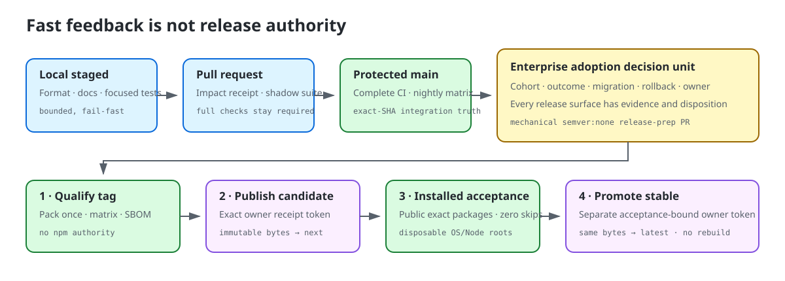

# Delivery governance

AIH separates engineering feedback from an enterprise release decision. Repository work may move
quickly; a package becomes an enterprise adoption event only when a coherent, evidenced outcome is
qualified, published as a candidate, accepted from public installed bytes, and explicitly promoted.
No fixed calendar, soak duration, or generic emergency taxonomy creates release authority.

<p align="center">
  
</p>

## Delivery lanes

| Lane | Purpose | Authority and evidence |
| --- | --- | --- |
| Local staged | Fast feedback before a commit. | Tracked-artifact checks, staged-file formatting, documentation lint when applicable, and mapped focused tests. It never runs the complete suite or coverage. |
| Pull request | Review an independently mergeable change. | A deterministic impact receipt records the exact base/head SHAs, paths, rules, tests, operating systems, risk class, and fallback reasons. The selector is shadow-only until replay evidence is reviewed; the existing complete required checks remain authoritative. |
| Protected main | Establish integration truth. | The complete CI matrix remains the source receipt for a candidate SHA. Scheduled safety runs exercise the complete suite and cold packed lifecycle across supported Node and operating-system lines. |
| Release preparation | Assign one version to one coherent enterprise outcome. | A PR that changes Core version identity or `release/enterprise-change.json`—and every `release/v-core-*` PR—must carry exactly `semver:none` and may change only version metadata, release notes, support/versioning text, and the enterprise manifest. Runtime or trust-boundary changes are rejected regardless of branch name. |
| Qualification | Freeze and test one candidate without publishing it. | An annotated protected tag triggers a read-only workflow. It proves protected-main ancestry and exact-SHA CI, validates the enterprise manifest, packs once, tests that artifact on the supported matrix, produces an SBOM, and seals a content-addressed qualification receipt. |
| Candidate publication | Make qualified bytes publicly inspectable without recommending them. | A later dispatch resolves an exact owner comment bound to the qualification receipt and artifact digests, re-observes the active candidate, and publishes only those bytes under npm `next`. |
| Installed acceptance | Test the public supply path. | Exact Core, Scanner, and Catalog versions are installed from npm in disposable roots. npm signatures, CLI help/version, and `aih verify-release` must pass with zero skipped legs on the matrix. |
| Promotion | Change the supported default without rebuilding. | A separate owner comment is bound to both qualification and installed-acceptance receipts. A read-only workflow verifies it. npm Trusted Publishing does not authorize dist-tag changes, so the final `latest` and GitHub Release changes use an interactive 2FA-capable owner session. |

The local and pull-request lanes reduce feedback time. They do not reduce release evidence. Unknown
paths, lockfiles, workflow/schema/fixture changes, selector changes, missing diff state, and any
classifier inconsistency fail closed to the complete suite.

## Enterprise adoption decision unit

Every candidate carries exactly one enterprise adoption decision unit (EADU) in
`release/enterprise-change.json`. It states:

- the affected cohort and outcome;
- all changes included in that outcome;
- adoption posture (`no-action`, `optional`, `recommended`, `required`, or `security-urgent`) and
  rationale;
- prerequisites, rollout, rollback, support impact, and accountable owner;
- a changed, unchanged, or not-applicable disposition for every release surface;
- evidence digests, known issues, and waivers.

The required surface inventory is code-owned by `RELEASE_SURFACES` in
`src/internals/delivery-governance.ts`: CLI flags and exit codes, library exports, schemas,
machine-readable output, generated artifacts, administrator controls, installation and removal,
files/environment/credentials, network/telemetry/data classes, direct and transitive dependencies,
install scripts, licenses/CVEs, trust roots/provenance, guides, known issues, waivers, support, and
rollback.

A changed surface must describe its previous and next state, affected cohort, operator action,
compatibility, risk, documentation, migration, owner, and at least one evidence digest. An unchanged
surface also requires evidence. `not-applicable` must explain why and cannot pretend to have
supporting evidence. Validation rejects an incomplete inventory.

The manifest intentionally does not contain its own Git commit SHA. A commit cannot truthfully embed
its own hash. The qualification receipt observes and binds the exact tagged source SHA, annotated tag
object, artifact ID/digest, tarball SHA-256, enterprise-manifest digest, SBOM digest, workflow run, and
protected-main CI receipt after the immutable tag exists.

## Cumulative enterprise review

An organization may evaluate less often than AIH releases. Produce one ordered cumulative delta from
the organization's approved version to a proposed version:

```bash
npm run release:governance -- cumulative 0.5.0 0.7.0 cumulative.json \
  manifests/0.6.0.json manifests/0.7.0.json
```

The command rejects gaps, branches, cycles, rollback, or a destination that is not reachable from the
approved baseline. Its output retains every intervening decision unit and every surface disposition;
it does not collapse risk into only the newest changelog.

## Candidate state and authorization

Qualification prints one `AIH-PUBLISH-V1 ...` token. Publication accepts only a GitHub issue-comment
URL on the manifest's tracker where the repository owner posted that complete token on its own line
after qualification. The token binds the package/version, source SHA, tag and tag object, tarball
digest, workflow artifact identity, enterprise manifest, SBOM, workflow run, and full qualification
receipt.

Installed acceptance prints one `AIH-PROMOTE-V1 ...` token. Promotion accepts only a later owner
comment on the same tracker, bound to the qualification receipt, npm integrity, registry-byte digest,
companion versions, and installed-acceptance receipt. Merge approval, tag creation, publication, and
promotion are distinct decisions; one never implies another.

The owner can invalidate a qualified candidate by posting the exact state token derived from its
qualification receipt:

```text
AIH-CANDIDATE-STATE-V1 sha256:<qualification-receipt-digest> rejected
AIH-CANDIDATE-STATE-V1 sha256:<qualification-receipt-digest> superseded
```

Every manifest and qualification tracker is first bound to the repository executing the workflow.
All tracker comments are read with pagination. Candidate state is checked during authorization and
again immediately before npm publication. An invalidated candidate cannot publish or promote. The
workflow records attributable owner evidence; it does not claim independent two-person approval.
Organizations that require separation of duties must configure an independent protected-environment
reviewer and disable bypass before making that claim.

GitHub Release assets are recovery and distribution mirrors, not immutable authority. Their bytes are
verified against the qualification, checksum, signature, npm provenance, and registry identity; an
asset edit or deletion cannot redefine the accepted package. Workflow artifacts are likewise retained
evidence with IDs and digests, not an indefinite-storage claim.

## Release preparation and operation

1. Keep incomplete work in draft PRs or behind an explicit compatibility boundary. Merge small,
   reviewable changes with their real `semver:*` classification; repository-only controls use
   `semver:none`.
2. When a coherent EADU is ready, sweep the release tracker/milestone and create the mechanical
   `release/v-core-X.Y.Z` PR. Run release preflight, author the complete enterprise manifest, update
   version metadata and release guidance, and keep the PR inside the enforced allowlist.
3. After the release PR merges and the owner decides to freeze the candidate, create and push an
   annotated `v-core-X.Y.Z` tag. The tag workflow qualifies only; it cannot publish.
4. Review the qualification receipt and post its exact publication token on the tracker. Dispatch
   `release.yml` **at the qualified tag ref** with the tag, qualification run ID/attempt, and comment
   URL. The workflow rejects any other dispatch revision, then re-observes the tag, protected-main
   ancestry, active state, and exact artifacts before publishing to `next`.
5. Dispatch `installed-acceptance.yml` **at the same qualified tag ref** with exact stable version strings for Core and compatible
   Scanner/Catalog plus the qualification run identity. Never use ranges or dist-tags in this gate.
6. Review the installed-acceptance receipt and post its exact promotion token. Dispatch the read-only
   `promotion-authorization.yml` **at the same qualified tag ref**; then run only its printed
   interactive dist-tag and GitHub Release commands. Re-observe npm and GitHub before closing the
   tracker.

The current supported line is the promoted stable train. A candidate under `next` is evidence for
evaluation, not an upgrade instruction. Release notes must say what an organization gains, who is
affected, what changes operationally, and whether adoption is no-action, optional, recommended,
required, or security-urgent.

## Rejection, rollback, and repair

- Never move, delete, or reuse an immutable version tag.
- Reject or supersede a candidate with the exact state token and leave it off `latest`.
- If rejected bytes are already on npm, deprecate the exact version with a precise reason; do not
  unpublish it or erase its evidence.
- If promotion caused harm, point `latest` back to the last accepted version and mark the affected
  GitHub Release accordingly. Pinned enterprise installations do not roll back automatically.
- Repair code and bytes in a new version. Do not rebuild or republish an existing version.
- Preserve failed qualification, publication, acceptance, and promotion evidence on the tracker.

## Selector graduation evidence

The pull-request selector starts in shadow mode. It may replace a complete required test context only
after representative replay demonstrates zero missed failures, deterministic receipts, bounded
runtime reduction, and reliable full-suite fallback for unknown and high-risk changes. Review also
compares false negatives, fallback rate, selected-test precision, operating-system coverage, and time
to useful feedback. No numeric target or time window is invented in advance; owners record the
observed pilot evidence and the explicit graduation decision. Until then, branch protection continues
to require the complete existing checks.
