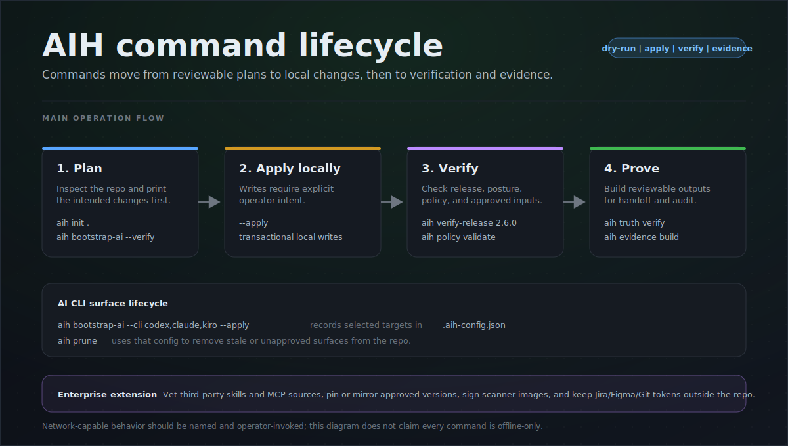

# CLI Lifecycle Guide to AI-Harness

Use this guide when a repo changes which AI CLI surfaces it supports: for example, the repo started with Kiro, Claude later became approved, and the team wants to add Claude setup and prune Kiro artifacts.

Posture is separate from CLI selection. If enterprise posture is already resolved through repo config or `AIH_ORG_POLICY`, the commands below can omit `--posture`; add `--posture enterprise` only when the operator needs an explicit command-line posture.



## 1. Mental Model

`aih bootstrap-ai` owns the committed CLI target set. It writes `.aih-config.json` with the resolved `targets` list, emits the per-CLI adapter notes, and merges the native bootloader files for the selected CLIs.

`aih prune` does not select a new target. It reads committed intent from `.aih-config.json` and removes stale per-CLI artifacts for tools that are wired on disk but no longer listed as targets. Passing `--cli`, `--all-tools`, or `--detect` to `prune` is ignored for selection; re-target first with `aih bootstrap-ai --cli <full-list> --apply`.

Use the full intended CLI list when re-targeting:

- Keep Kiro and add Claude: `aih bootstrap-ai --cli kiro,claude --apply`
- Move from Kiro to Claude only: `aih bootstrap-ai --cli claude --apply`
- Add Claude to a broader set: include every CLI that should remain, for example `aih bootstrap-ai --cli claude,codex,cursor --apply`

## 2. Kiro Now, Claude Approved Later

Preview the current state:

```powershell
aih status
aih bootstrap-ai --cli kiro,claude
```

Apply only after reviewing the diff:

```powershell
aih bootstrap-ai --cli kiro,claude --apply
aih bootstrap-ai --verify
```

Set up Claude-specific surfaces after the repo targets Claude:

```powershell
aih mcp --cli claude --apply
aih ecc --cli claude --profile core --apply
aih usage --cli claude --apply
aih skill sync --name <approved-skill> --cli claude --apply
aih doctor
```

What this does:

- `bootstrap-ai --cli kiro,claude` keeps Kiro targeted and adds Claude's `CLAUDE.md` bootloader plus Claude's adapter note.
- `mcp --cli claude` writes Claude's repo MCP config shape, `.mcp.json`.
- `ecc --cli claude` installs ECC for Claude through ECC's installer path.
- `usage --cli claude` wires local usage capture for Claude when that local diagnostic layer is desired.
- `skill sync --cli claude` copies an already approved promoted skill into Claude's machine skill-discovery directory.

## 3. Move From Kiro To Claude

Use this when Claude is the only intended CLI and Kiro should be removed from the repo.

First re-target the repo:

```powershell
aih status
aih bootstrap-ai --cli claude
aih bootstrap-ai --cli claude --apply
aih bootstrap-ai --verify
```

Then prune stale Kiro artifacts:

```powershell
aih prune
aih prune --apply
aih bootstrap-ai --verify
aih doctor
```

Expected Kiro cleanup is marker-bound and conservative. AI-Harness-owned files and blocks can be moved to `.aih/legacy/` or subtracted in place. Kiro MCP/settings entries that cannot be separated safely are printed as manual-review advisories instead of being edited blindly.

Do not use this form:

```powershell
aih prune --cli claude --apply
```

That command may run, but `--cli claude` does not tell `prune` to keep only Claude. Prune still reads `.aih-config.json`.

## 4. Enterprise Developer Variant

When an enterprise developer is consuming admin policy, keep the same sequence but set the policy override first and keep `--mcp-compliant` on MCP writes:

```powershell
$AdminConfigDir = Join-Path $HOME "aih-admin-configuration"
$env:AIH_ORG_POLICY = Join-Path $AdminConfigDir "aih-org-policy.json"
aih policy validate
aih bootstrap-ai --cli claude --posture enterprise --apply
aih bootstrap-ai --verify
aih mcp --cli claude --posture enterprise --mcp-compliant --apply
aih mcp --cli claude --posture enterprise --mcp-compliant --verify
aih ecc --cli claude --profile core --posture enterprise --apply
aih usage --cli claude --posture enterprise --apply
aih prune
aih prune --apply
aih doctor --posture enterprise
```

Use this only after the admin policy allows the Claude surface and any required MCP servers or skills. Policy approval does not authenticate the developer to Claude, GitHub, Jira, Figma, or AWS; local auth remains local.

## 5. Verification Checklist

Run these before calling the migration complete:

```powershell
aih status
aih bootstrap-ai --verify
aih doctor
aih secrets --verify
```

For enterprise:

```powershell
aih policy validate
aih mcp --cli claude --posture enterprise --mcp-compliant --verify
aih doctor --posture enterprise
```

Check the diff for three things:

- `.aih-config.json` has the intended `targets` list.
- The desired CLI bootloader and adapter exist.
- Dropped CLI artifacts were either removed by `prune` or listed for manual review.

## 6. Pitfalls To Avoid

- Do not treat `aih prune --cli <tool>` as re-targeting. It is not.
- Do not omit a CLI from `bootstrap-ai --cli <list>` unless you intend to drop it.
- Do not use `--unrunnable` to prune a tool merely because a shell cannot find its binary. A PATH problem looks the same as a dropped CLI.
- Do not hand-edit generated managed blocks. Re-run `aih bootstrap-ai --cli <full-list> --apply`.
- Do not commit local tokens or OAuth state while adding a CLI-specific MCP setup.
